<p align="center">
  
</p>

<h1 align="center">EasyLab</h1>

<p align="center">
  <strong>Cloud Infrastructure Lab Management Made Easy</strong>
</p>

<p align="center">
  <a href="https://go.dev/"></a>
  <a href="LICENSE"></a>
  <a href="#"></a>
  <a href="#"></a>
  <a href="https://goreportcard.com/"></a>
</p>

<p align="center">
  <a href="#-quick-start">Quick Start</a> •
  <a href="#-features">Features</a> •
  <a href="#-architecture">Architecture</a> •
  <a href="#-documentation">Documentation</a> •
  <a href="#-contributing">Contributing</a>
</p>

---

## Introduction

EasyLab is a comprehensive platform that streamlines cloud infrastructure lab management for **educators**, **workshop organizers**, and **DevOps teams**. It automates the provisioning of Kubernetes clusters and development workspaces on OVHcloud, enabling you to focus on teaching and learning rather than infrastructure setup.

With an intuitive web interface for both administrators and students, EasyLab transforms complex infrastructure-as-code workflows into simple, one-click deployments.

---

## 🏗️ Architecture

```mermaid
flowchart TB
    subgraph users [Users]
        Admin[👤 Admin]
        Student[👨‍🎓 Student]
    end
    
    subgraph webapp [EasyLab Web App]
        WebUI[🌐 Web Interface]
        API[🔌 REST API]
        JobMgr[📋 Job Manager]
    end
    
    subgraph infra [Infrastructure]
        Pulumi[⚙️ Pulumi Engine]
        OVH[☁️ OVHcloud]
        K8s[☸️ Kubernetes Cluster]
        Coder[💻 Coder Workspaces]
    end
    
    Admin --> WebUI
    Student --> WebUI
    WebUI --> API
    API --> JobMgr
    JobMgr --> Pulumi
    Pulumi --> OVH
    OVH --> K8s
    K8s --> Coder
```



---

## ✨ Features

<table>
<tr>
<td width="33%" valign="top">

### 👤 Admin Interface

- **Lab Creation** - Design and deploy infrastructure labs
- **OVHcloud Integration** - Direct integration with OVHcloud APIs
- **Job Management** - Monitor deployment status and logs
- **Kubeconfig Access** - Download cluster configurations

</td>
<td width="33%" valign="top">

### 👨‍🎓 Student Interface

- **Workspace Requests** - Request access to development environments
- **Lab Catalog** - Browse available infrastructure labs
- **Session Management** - Secure access to provisioned resources
- **Self-Service** - Easy onboarding process

</td>
<td width="33%" valign="top">

### ☸️ Infrastructure

- **Kubernetes Clusters** - Automated K8s cluster creation
- **Network Setup** - Private networks and gateways
- **Node Pools** - Configurable worker node pools
- **Coder Integration** - Development workspace provisioning

</td>
</tr>
</table>

---

## 🚀 Quick Start

Choose your preferred deployment method:

<details>
<summary><strong>🖥️ Local Development</strong></summary>

```bash
# 1. Clone repository
git clone <repository-url>
cd easylab

# 2. Install dependencies
go mod tidy

# 3. Set environment variables
export LAB_ADMIN_PASSWORD="your-password"

# 4. Run the application
go run cmd/server/main.go

# 5. Access at http://localhost:8080
```

</details>

<details>
<summary><strong>🐳 Docker</strong></summary>

```bash
# 1. Set required passwords
export LAB_ADMIN_PASSWORD="your-secure-password"
export LAB_STUDENT_PASSWORD="your-student-password"

# 2. Start the application
docker-compose up -d

# 3. Access at http://localhost:8080
```

</details>

<details open>
<summary><strong>☸️ Kubernetes</strong></summary>

```bash
# 1. Build and push container image
docker build -t your-registry/easylab:latest .
docker push your-registry/easylab:latest

# 2. Deploy to Kubernetes
cd k8s-deployment && ./deploy.sh

# 3. Configure secrets
kubectl edit secret easylab-secrets -n easylab
```

</details>

---

## ⚙️ Configuration

### Essential Environment Variables

| Variable | Description | Default |
|----------|-------------|---------|
| `LAB_ADMIN_PASSWORD` | Password for admin interface | `admin123` |
| `LAB_STUDENT_PASSWORD` | Password for student interface | `student123` |
| `WORK_DIR` | Directory for job workspaces | `/tmp/easylab-jobs` |
| `DATA_DIR` | Directory for application data | `/tmp/easylab-data` |
| `OVH_ENDPOINT` | OVHcloud API endpoint | `ovh-eu` |
| `OVH_APPLICATION_KEY` | OVHcloud application key | - |
| `OVH_APPLICATION_SECRET` | OVHcloud application secret | - |
| `OVH_CONSUMER_KEY` | OVHcloud consumer key | - |
| `OVH_SERVICE_NAME` | OVHcloud project/service name | - |

### Example `.env` File

```bash
# OVHcloud credentials
OVH_APPLICATION_KEY=your-key
OVH_APPLICATION_SECRET=your-secret
OVH_CONSUMER_KEY=your-consumer-key
OVH_SERVICE_NAME=your-service-name
OVH_ENDPOINT=ovh-eu

# Application settings
LAB_ADMIN_PASSWORD=your-secure-password
LAB_STUDENT_PASSWORD=student-password
```

**Usage:**
```bash
go run cmd/server/main.go -env-file=.env -port=8080
```

---

## 📚 Documentation

| Document | Description |
|----------|-------------|
| [DOCKER_README.md](DOCKER_README.md) | Docker deployment guide |
| [K8S_README.md](K8S_README.md) | Kubernetes deployment details |
| [TESTING.md](TESTING.md) | Testing documentation |
| [COVERAGE_SETUP.md](COVERAGE_SETUP.md) | Code coverage setup |

---

## 🛠️ Development

### Prerequisites

- **Go 1.24+** - [Download](https://go.dev/dl/)
- **Docker** - For containerized deployment
- **kubectl** - For Kubernetes deployment
- **OVHcloud account** - For infrastructure provisioning (optional)

### Building

```bash
# Build web application
go build -o easylab cmd/server/main.go

# Build Docker image
docker build -t easylab .
```

### Testing

```bash
# Run unit tests
make test

# Run with race detection
go test -race ./...

# Run E2E tests (Playwright)
npm test
```

### Hot Reload Development

Using [Air](https://github.com/air-verse/air) for live reloading:

```bash
# Install Air
go install github.com/air-verse/air@latest

# Run with hot reload
air
```

---

## 🤝 Contributing

We welcome contributions! Here's how you can help:

1. **Fork** the repository
2. **Create** a feature branch (`git checkout -b feature/amazing-feature`)
3. **Commit** your changes (`git commit -m 'Add amazing feature'`)
4. **Push** to the branch (`git push origin feature/amazing-feature`)
5. **Open** a Pull Request

### Code Style

- Follow standard Go conventions and `gofmt`
- Write tests for new functionality
- Update documentation as needed

### Reporting Issues

Found a bug or have a feature request? [Open an issue](../../issues) with a clear description.

---

## 📄 License

This project is licensed under the **Apache License 2.0** - see the [LICENSE](LICENSE) file for details.

---

## 🙏 Acknowledgements

EasyLab is built on the shoulders of giants:

- [**OVHcloud**](https://www.ovhcloud.com/) - Cloud infrastructure provider
- [**Pulumi**](https://www.pulumi.com/) - Infrastructure as Code platform
- [**Coder**](https://coder.com/) - Development workspace platform
- [**Go**](https://go.dev/) - Programming language
- [**Kubernetes**](https://kubernetes.io/) - Container orchestration

---

<p align="center">
  Made with ❤️ for the DevOps community
</p>
