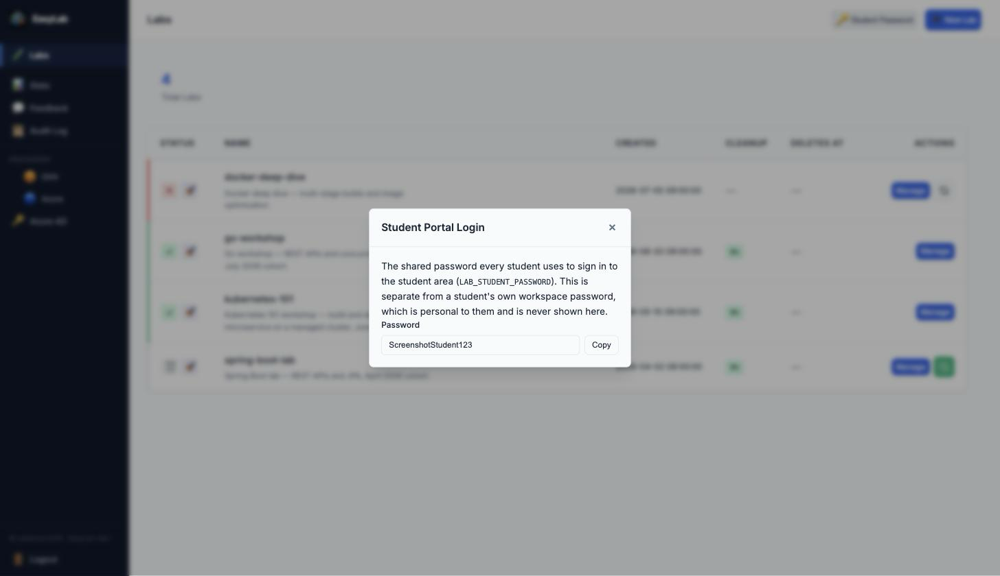
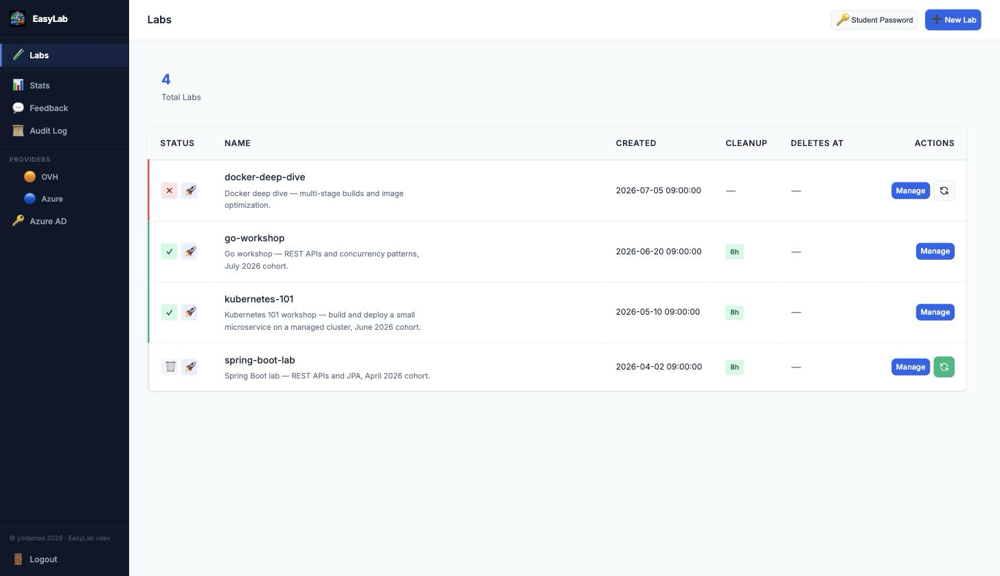
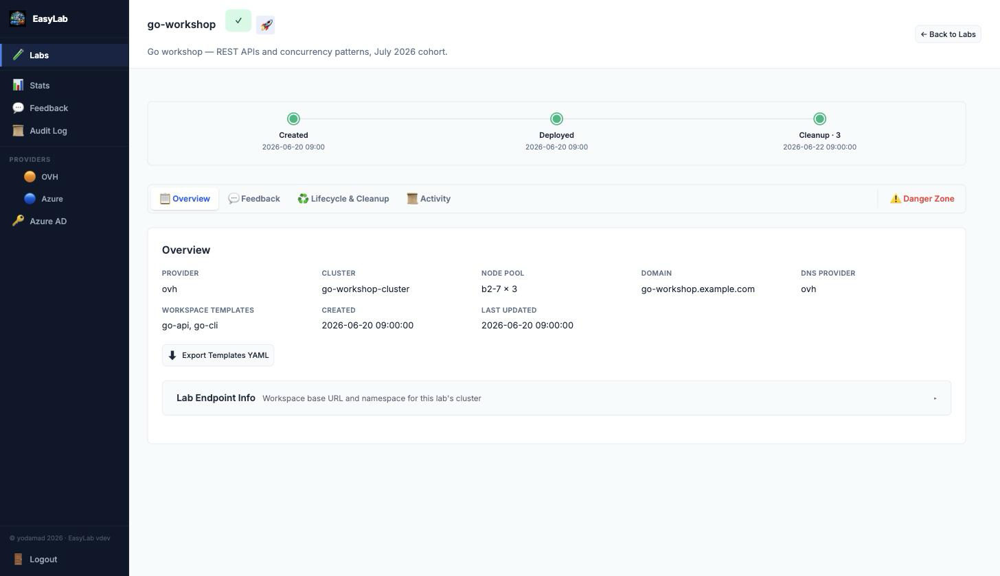
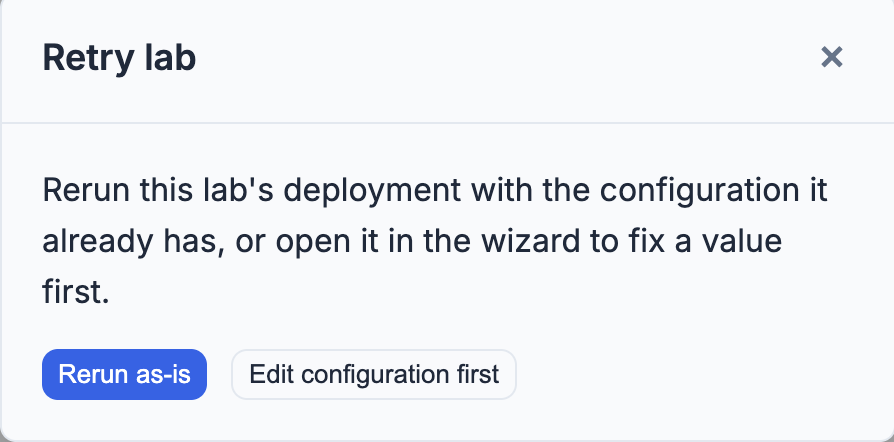
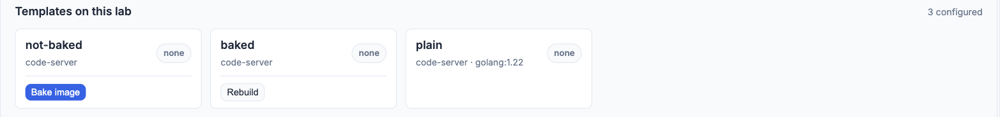
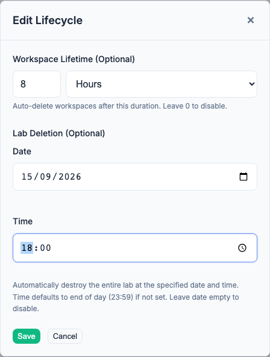

# Managing Labs

This page covers everything you can do with a lab once it exists: the labs list,
the lab detail page, retrying or recreating a lab, adding templates, editing
lifecycle policies, and lab credentials. See [Creating a Lab](admin-lab-creation.md)
for the creation wizard itself.

## Manage your labs

Clicking on the `Labs` button in the header will redirect you to the labs list page. The **Provider** dropdown is available on every admin page and navigates directly to the OVH or Azure configuration page.

The page header also has a **Student Password** button, next to **New Lab**. Click it
to reveal the shared password students use to sign in to the student area (set via the
`LAB_STUDENT_PASSWORD` environment variable — see [Docker configuration](docker.md)),
with a **Copy** button alongside — handy if you're administering EasyLab without shell
or deployment access and don't want to track down whoever set that variable. This is
the password students type on `/student/login` to reach the student portal; it has
nothing to do with, and is never the same as, an individual student's own workspace
(code-server) password, which is personal to that student and generated per-workspace
— EasyLab never exposes a student's workspace password through the admin UI. If
`LAB_STUDENT_PASSWORD` isn't set, the dialog says so — classic student login is
disabled in that case, and students can only sign in via Azure AD if it's configured
(see [Azure AD authentication](azure-ad.md)).

{width=450}

{width=850}

The table shows, per lab:

* **Status** — created, running, completed, failed, destroyed, or dry-run-completed (preview-only)
* **Name** — the stack name and description you gave it when creating it
* **Creation date**
* **Cleanup** — the workspace lifetime policy (*i.e. after how many hours/days the workspaces will be deleted*)
* **Deletes at** — the lab's scheduled auto-destroy date, if one is set

The list is paginated at 25 labs per page once you have more than that; use the **Previous**/**Next** buttons at the bottom of the table to navigate.

Every row's **Actions** column has a single **Manage** button that opens the lab's own
[detail page](#the-lab-detail-page) — everything you can do with a lab lives there now.
The one exception is a status-contextual quick action next to **Manage**: a **Retry**
button on a failed lab, or a **Recreate** button on a destroyed one, so you can act on
several labs from the list without opening each one individually. Both open the same
[retry/recreate choice](#retry-or-recreate-a-lab) the detail page's Danger Zone offers.

### The lab detail page

Clicking **Manage** on any lab opens `/labs/{id}` — one page with everything about that
lab, organized into tabs at the top:

{width=850}

* **Overview** — provider, cluster, node pool, domain, DNS provider, and configured
  workspace templates at a glance; the **Download Kubeconfig** and **Export Templates
  YAML** actions; and, once the lab is completed, an inline **Lab Endpoint Info** panel
  with the workspace base URL and namespace (this replaces the old read-only modal).
  A small **lifecycle strip** under the page header plots the lab's timeline — created,
  deployed, each automatic cleanup sweep, and its scheduled or actual destruction — using
  the same data as the Lifecycle & Cleanup section below.
* **Progress** — shown only while a lab is pending, running, failed, or a completed dry
  run; this is the same live-updating deployment log the creation wizard shows, embedded
  here instead of on a separate page.
* **Workspaces & Templates** — shown once the lab is completed; this absorbs everything
  that used to live on the standalone **View Workspaces** page: the **Credentials**
  panel, the **Templates on this lab** panel (with **Bake image**/**Rebuild**), the
  **Add Template** drawer, and the **Active Workspaces**/**History** tabs. See
  [Templates on a lab](#templates-on-a-lab) and the sections after it below — the
  content is unchanged, only where you reach it moved.
* **Feedback** — a compact summary (average rating, most recent comments) with a link to
  the full [feedback page](feedbacks.md) for this lab.
* **Lifecycle & Cleanup** — an inline form for the workspace lifetime and lab deletion
  date/time (this replaces the old **Edit Lifecycle** modal), plus a history table of
  every automatic cleanup sweep that has run.
* **Activity** — this lab's entries from the [audit log](audit-log.md), filtered to just
  this lab.
* **Danger Zone** — **Retry**, **Recreate**, **Destroy Stack**, and **Remove Lab**,
  status-gated the same way they always were, now grouped together and visually set
  apart rather than mixed in with everything else.

The old `/labs/{id}/workspaces` URL still works — it redirects into this page's
Workspaces & Templates section.

### Retry or recreate a lab

Clicking **Retry** on a failed lab, or **Recreate** on a destroyed one — from the list's
quick-action button or from the detail page's Danger Zone — first asks you to
choose between two options:

{width=450}

* **Rerun as-is** — behaves exactly as before: the lab is retried/recreated with the
  configuration it already has, without opening the wizard. For **Recreate**, this still
  prompts for any credentials the lab's templates reference and, if the lab's scheduled
  [deletion date](admin-lab-creation.md#lab-deletion) has already passed, a new date.
* **Edit configuration first** — opens the full lab creation wizard, pre-filled with the
  lab's current settings (network, compute, DNS/HTTPS, workspace templates, lifecycle),
  so you can fix a value — a wrong region, an unavailable flavor, a stale domain — before
  resubmitting.

A few things to know when editing before a retry or recreate:

* **Secrets are never pre-filled.** Provider API credentials, DNS credentials, and a
  BYO-Kubernetes kubeconfig are stripped from the lab's stored configuration before it
  reaches the wizard, the same way they already are everywhere else EasyLab exposes a
  lab's config. Leaving these fields blank when editing a **retry** keeps the lab's
  existing values; leaving them blank when editing a **recreate** means none — you must
  re-enter them there, the same as with **Rerun as-is**.
* **The lab name (stack name) cannot be changed when editing before a retry.** A retry
  reuses the same underlying Pulumi stack, so the field is read-only in that mode. It
  stays editable when editing before a recreate, since recreating always provisions a new
  stack.
* **Editing before a retry keeps the same lab.** Submitting applies your changes to the
  same failed lab and reruns it — it does not appear as a new entry in the labs list.
  **Editing before a recreate**, like **Rerun as-is**, always creates a new lab entry; the
  destroyed one stays in the list for history.
* Avoid switching a lab between **Create New Infrastructure** and **Use Existing
  Cluster** when editing before a **retry** of a stack that has already provisioned real
  cloud resources — Pulumi would treat the switch as those resources no longer being
  wanted and destroy them. This is safe to change freely when editing before a
  **recreate**, since that always starts a fresh stack.

### Templates on a lab

The lab detail page's **Workspaces & Templates** section shows a **Templates on this
lab** panel above the workspace list. It lists every template configured on the lab, with its IDE and
image (or `devcontainer` when the workspace is built from a devcontainer), and a
badge telling you which templates currently have running student workspaces:

* **● N running** — N live workspaces were created from that template.
* **none** — the template is configured but no student has an active workspace
  from it yet.

Use the **Refresh** button to update the counts as students start and stop
workspaces.

> Attribution applies to workspaces **created after this feature shipped**. Any
> workspace that was already running beforehand has no template recorded and is
> reported as a small "not attributed to a template" note; it is attributed once
> the workspace is recreated. Because workspaces are cleaned up on their lifetime,
> this resolves on its own.

### Pre-baking a devcontainer template

A devcontainer template's card carries a **Bake image** button (**Rebuild** once a
bake has already succeeded); a plain (non-devcontainer) template shows neither:

{width=700}

Baking builds the devcontainer **once**, pushes the result as a normal image, and
records it on the lab — every student workspace for that template then does an
ordinary image pull instead of running the build itself.
This skips both the build *and* the per-pod layer extraction described in
[A warm cache skips the build, not the extraction](templates.md#devcontainer-workshops), which is the larger cost even with a warm `cache_repo`.

Clicking the button starts a background build and shows a **building** badge that
updates on its own; it turns into a **baked _(date)_** badge once done, or shows the
failure if it did not succeed. Building runs as a one-off job in the lab's cluster,
entirely separate from any student's workspace — no one waits on it.

A **failed** badge covers two different things, both worth knowing apart: the build
itself can fail (a bad devcontainer.json, an unreachable base image), or the build
can succeed and push fine but the image never becomes *pullable* — EasyLab confirms
the image is actually fetchable, over the same trusted connection a student's pod
would use, before ever showing **baked**. The second case almost always means an
in-cluster registry whose TLS certificate hasn't finished issuing (or never will,
if the lab's cert-manager `ClusterIssuer` doesn't exist) — see the troubleshooting
table in [Devcontainer workshops](templates.md#devcontainer-workshops) for what to
check. **Rebuild** retries the whole thing once the underlying issue is fixed.

!!! warning "Baking to the in-cluster registry needs a domain"
    A template using **Host in-cluster** for its cache registry can only be baked
    once the lab has a domain configured. The build itself doesn't need one — the
    reason is what happens *after*: a student's workspace pulls the baked image the
    same way it pulls any other image, which requires a registry the cluster
    trusts. The in-cluster registry gets that trust from the lab's own domain
    certificate; without a domain there is nothing to issue one from, and baking is
    rejected with an explanation. A template with an **external** cache registry
    has no such requirement — that registry is already trusted independently of
    this lab.

!!! tip "A bake does not track the repository"
    Baking is a point-in-time snapshot: it is not re-triggered automatically if the
    workshop repository's `devcontainer.json` changes afterward. Click **Rebuild**
    whenever the source changes and you want students to get the update — until
    then, students keep getting the previously baked image.

### Workspace history

The workspace list sits behind an **Active Workspaces** / **History** pair of tabs
(each labelled with a live count) — separating the current cluster state from the
lab's full activity log keeps either one from crowding out the other. The
**Refresh** button applies to whichever tab you're on and sits with the tabs
rather than inside either one.

**History** records every workspace **created** and **deleted** for the lab,
newest first — who owned it, which template it came from, and when. Unlike
**Active Workspaces**, this is not a live view of the cluster: a workspace still
shows up here after it has been deleted (by a student, by you, or by automatic
lifetime cleanup), which is what lets you see who held a workspace once it is gone.

Each entry shows:

* A green **+** badge for a creation, or a red **−** badge for a deletion
* The workspace name and owner's **email** (falls back to the sanitized workspace
  username for workspaces created before email tracking was added)
* The template it was created from (blank for workspaces created before template
  attribution was added)
* The date and time of the event

The **Active Workspaces** tab's Owner column follows the same rule: email when
known, the sanitized username otherwise.

The history is stored with the lab and survives a server restart; it is cleared
when the lab itself is deleted.

Use **Export CSV**, above the history list, to download the full history as a
`workspace-history-<lab>.csv` file — handy for record-keeping or sharing usage
with someone who doesn't have admin access.

### Add a template to an existing lab

The **Workspaces & Templates** section of a completed lab's detail page has an **Add
Template** button that opens a side drawer for appending a workspace template without
recreating the lab. It mirrors the wizard's **Workspace
Templates** step, so you define the workspace the same three ways:

* **Build with a form** — fill in the template name and git repository, with an
  **Advanced options** section for image, CPU/memory/disk, startup script, dotfiles,
  extensions, environment variables, sidecars, and mounts.
* **From a devcontainer** — name the template, then point at a workshop repository
  (or upload a `devcontainer.json` / repository `.zip`); EasyLab reads the
  devcontainer, generates the template YAML, and opens it for review before you add
  it. The name is required here too, so an import cannot silently reuse the name of
  a template already on the lab.
* **Paste YAML** — write (or **Validate**, or **Insert skeleton**) the template YAML
  directly. The document may define more than one template, and all are appended.

The drawer's context bar names the lab and lists the templates it already has, so a
duplicate name is visible before you submit (a clash is rejected). On success a toast
confirms the addition and the list refreshes.

> Credentials for private registries and repositories are configured when the lab is
> created (see below). A template added here can only reference a credential that
> already exists on the lab.

### Edit a lab's lifecycle

The **Lifecycle & Cleanup** section of a completed lab's detail page has an inline form
for changing the **Workspace Lifetime** and **Lab Deletion** date/time set during
creation (see [Cleaning Configuration](admin-lab-creation.md#cleaning-configuration-step-7) above) without
recreating the lab — this replaces the old **Edit Lifecycle** modal:

{width=450}

> **Note:** this screenshot still shows the old modal and needs retaking against the
> inline form described here.

* Change the workspace lifetime value/unit, or clear it (`0` or empty) to disable
  automatic workspace cleanup.
* Set, change, or clear the lab's scheduled deletion date and time. A cleared date
  disables scheduled lab deletion; a date must be in the future.

On save, a toast confirms the update and the page refreshes to show the new values —
including the cleanup history table further down this section, which records every
automatic sweep that has run. The new policy takes effect on the cleanup service's next
check.

## Lab credentials (private registries and repositories)

A lab whose workspaces use a private image or clone a private repository needs
credentials. Add them at either of two points:

* **During creation** — the **Workspace Templates** step of the wizard has a
  *Credentials* section at the top. Tokens entered there are held in memory and written
  to the cluster the moment it finishes provisioning, before the lab reports ready.
* **After the lab is up** — expand **Credentials** in the lab detail page's **Workspaces
  & Templates** section.

Two kinds:

* **Container registry** — a server, username and token. Referenced from a
  workspace template as `image_pull_secrets`, and by a devcontainer template as
  `devcontainer.registry_auth_secret`.
* **Git repository** — a username and token. Referenced from a workspace template
  as `git_auth_secret`. In the wizard's **Build with a form** path a single git
  credential is wired into every template with a private repo automatically; with
  several, pick the one each template uses under its **Advanced options → Git
  credential**. Leave the username blank and it defaults to `oauth2`, which is what
  GitLab expects with a personal access token.

The panel shows the exact line to paste into your template, and lists credentials
created out of band with `kubectl` alongside the ones added here.

How the token is handled, and what follows from it:

* **It is written straight to the lab's cluster and not kept by EasyLab.** It is
  never stored in the lab configuration, so it cannot appear in the job file, the
  jobs API, or the templates export — a template names a credential, it never
  contains one.
* **The Secret lives in the cluster.** Entered in the wizard, a token waits in
  memory only until provisioning finishes; entered on the lab detail page, it is
  written immediately. Either way EasyLab keeps no copy — which is why a wizard
  token is lost if the server restarts mid-provisioning, and the lab then shows the
  credential as pending rather than failing a student first.
* **Destroying a lab destroys its credentials.** Recreating a lab prompts you to
  re-enter the tokens, with the names and types carried over; a retried lab keeps
  them.
* **Saving over a name rotates it.** Running workspaces keep the old token until
  they are recreated.
* **A referenced-but-missing credential is flagged.** If a template names a
  credential the cluster does not have, the Credentials panel says which one.

Full reference, including the `kubectl` equivalents and the difference between
`image_pull_secrets` and `devcontainer.registry_auth_secret`, is in
[Workspace templates](templates.md#private-registries-and-repositories).

## Workspace access

Each student workspace is a code-server pod exposed (when a domain is
configured) at `https://{workspace}.{domain}/`. Access is gated by a per-student
**password** that EasyLab generates and shows to the student on the portal. The
student enters it on code-server's own login page when they open their
workspace, and EasyLab's own student authentication protects the portal itself.
