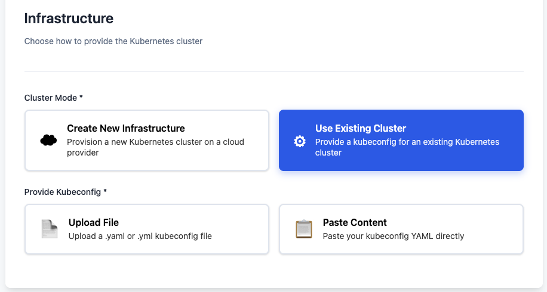
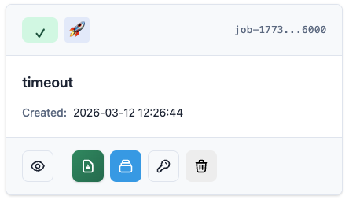
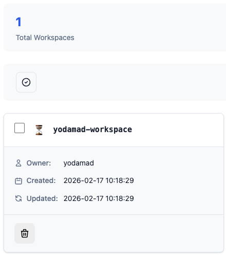

# Admin Space

As an admin (trainer, speaker, ...), you have access to the admin space to manage your labs:

* [x] Create a new lab
* [x] Set/update credentials for the cloud providers
* [x] Manage your labs
    * [x] See logs
    * [x] Delete a lab
    * [x] List workspaces
    * [x] Delete workspaces
    * [x] Retry a failing lab installation

## Create a new lab

First you need to choose how to provide the Kubernetes cluster:

* [x] [Create New Infrastructure](#on-ovhcloud) — Provision a new cluster on a cloud provider (OVHcloud)
* [x] [Use Existing Cluster](#use-existing-cluster) — Provide a kubeconfig for an existing Kubernetes cluster

{width=350}

### Use Existing Cluster

When you choose **Use Existing Cluster**, EasyLab skips cloud provider provisioning and uses your own Kubernetes cluster. This is useful when you already have a cluster (e.g. from your organization, a local dev environment, or another cloud provider).

**What you need to provide:**

* **Kubeconfig** — Either:
    * Upload a `.yaml` or `.yml` kubeconfig file, or
    * Paste the kubeconfig YAML content directly

**What is skipped:**

* No cloud provider credentials required
* No network, cluster, or node pool configuration
* The wizard goes directly to Coder setup and template selection

The kubeconfig must have sufficient permissions to create namespaces and deploy Helm releases (Coder, PostgreSQL) in the cluster.

### On OVHcloud (Create New Infrastructure)

When creating new infrastructure, you choose OVHcloud as the cloud provider. Most of the configuration is preconfigured; you only need to select the ID for the private network.

??? info "Others parameters can be overridden if needed"

    | Category | Parameter                       | Description                                              |
    |----------|----------------------------------|---------------------------------------------------------|
    | Network | | |
    | | Gateway Name             | The name of the network gateway                          |
    | | Gateway Model            | The model of the network gateway                         |
    | | Private Network Name     | The name of the network private network                  |
    | | Region                   | The region of the network                                |
    | | Mask                     | The mask of the network                                  |
    | Node Pool | | |
    | | Name                   | The name of the node pool                                |
    | | Flavor                 | The flavor of the node pool                              |
    | | Desired Node Count     | The desired number of nodes in the node pool             |
    | | Min Node Count         | The minimum number of nodes in the node pool             |
    | | Max Node Count         | The maximum number of nodes in the node pool             |

### Setup Coder instance

You need to setup the secrets for the Coder instance:

* [x] Coder Admin Password
* [x] Coder Db Password

??? info "Others parameters can be overridden if needed"

    * `Coder Admin Email`: The email of the coder admin
    * `Coder Version`: The version of the coder
    * `Coder Db User`: The user of the coder database
    * `Coder Db Password`: The password of the coder database
    * `Coder Db Name`: The name of the coder database
    * `Coder Template Name`: The name of the coder template

Then, you need to select the [Coder template](https://coder.com/docs/admin/templates){target="_blank"} you want to use.

Either you can upload a file:

* [x] a zip file containing the template and documentation
* [x] a single `.tf` file containing the template information

Or you can use a remote Git repository by providing:

* the repository URL
* the folder path (optional)
* the branch (optional)

## Manage your labs

Clicking on the `Labs` button in the header will redirect you to the labs list page.

{width=350}

You can see all the labs you have created with following information:

* status (created, running, completed, failed, destroyed)
* creation date
* access to the creation logs
* access to the kubeconfig file
* actions to destroy or recreate the lab (based on the status)
* list all workspaces created for this lab
    * you can delete workspaces one by one or in bulk

{width=350}