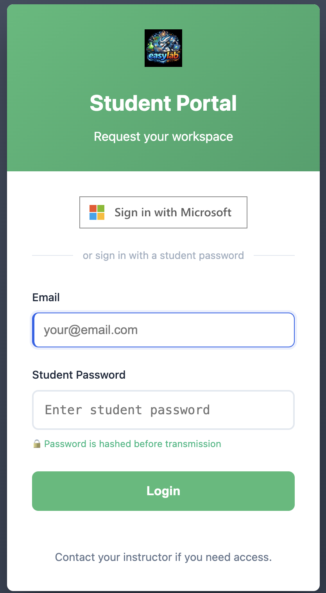
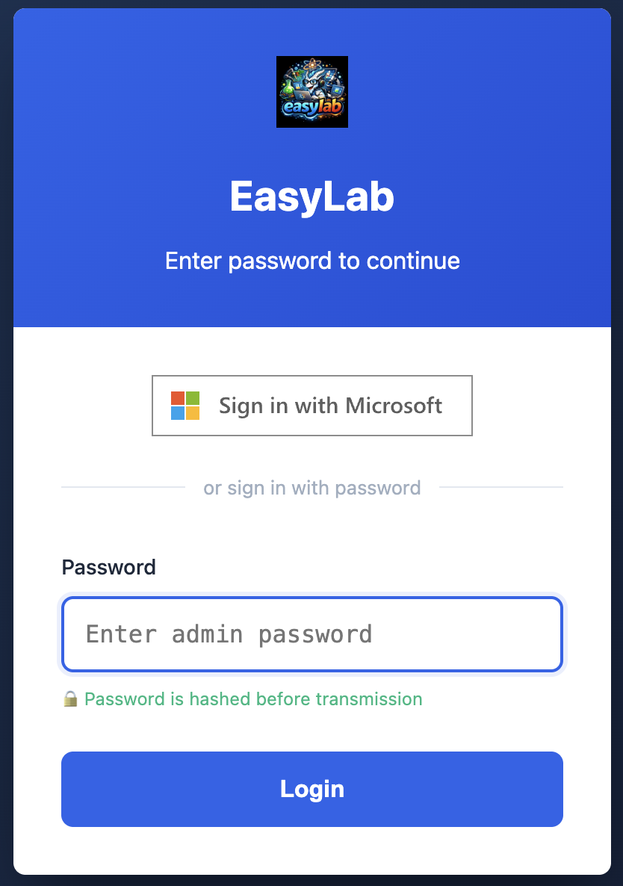
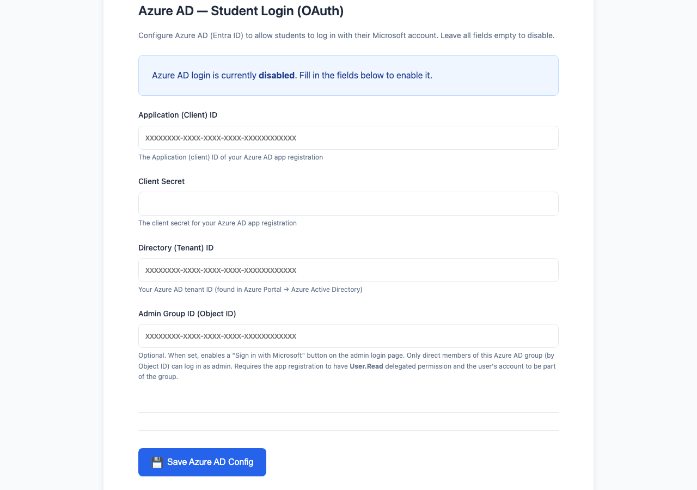
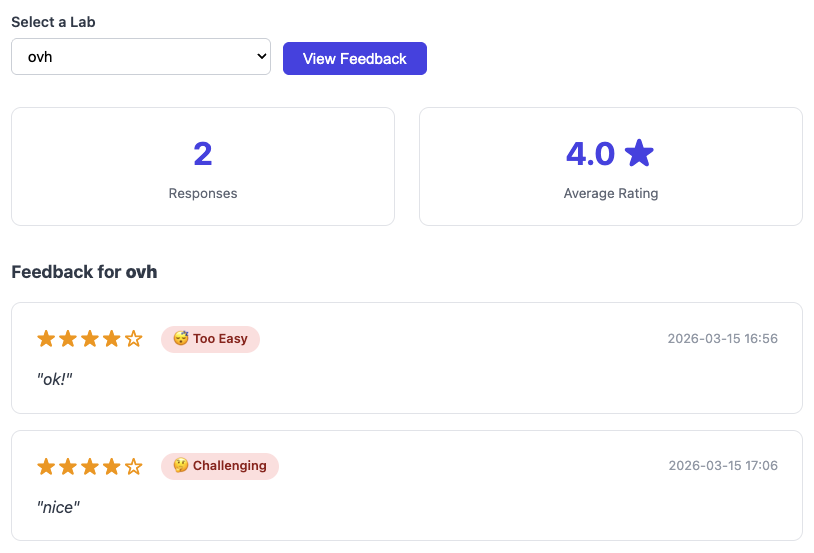
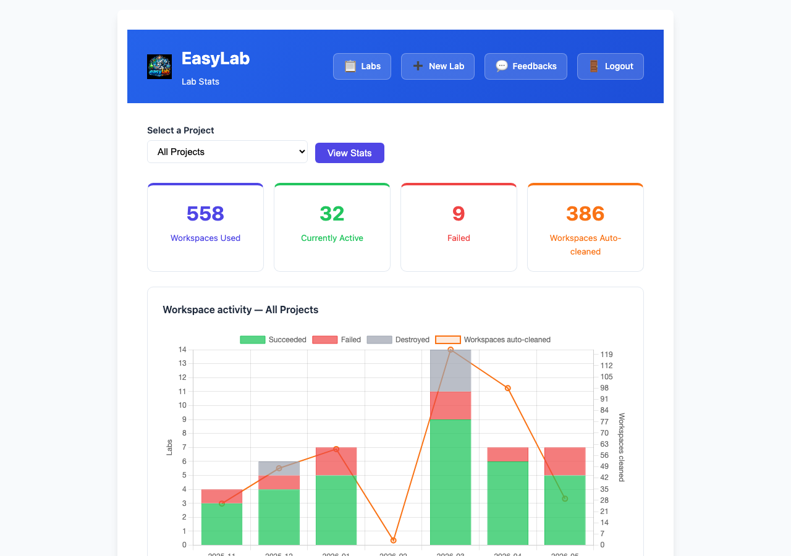
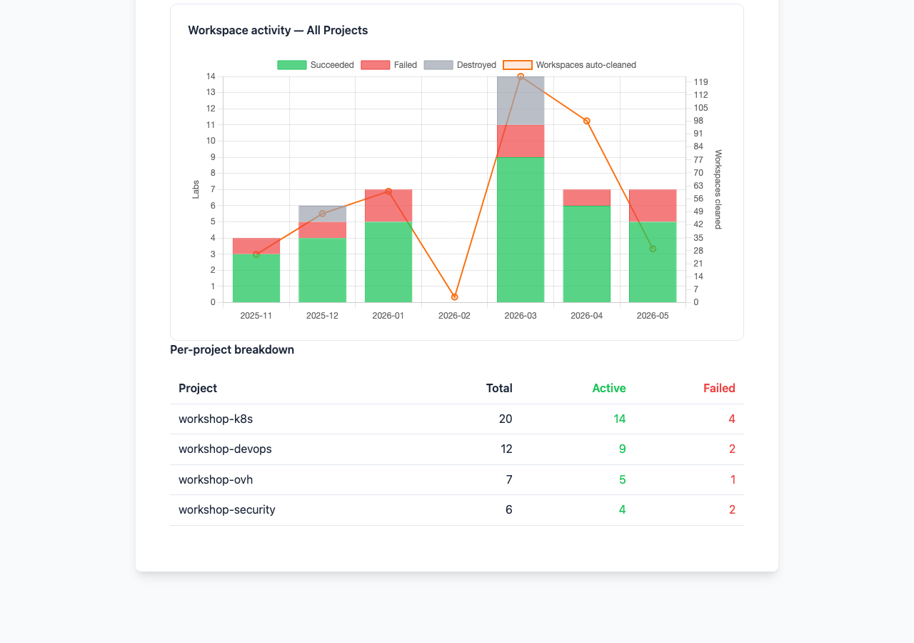

# Admin Space

As an admin (trainer, speaker, ...), you have access to the admin space to manage your labs:

* [x] Create a new lab
* [x] Define multiple Coder templates per lab (students get one workspace per template)
* [x] Dry run (preview) a lab before creating it
* [x] Set/update credentials for the cloud providers
* [x] Manage your labs
    * [x] See logs
    * [x] Retrieve Coder admin credentials (URL, email, password) for completed labs
    * [x] Delete a lab
    * [x] Recreate a destroyed lab with the same configuration
    * [x] List workspaces
    * [x] Delete workspaces (one by one or in bulk)
    * [x] Retry a failing lab installation
* [x] View student feedback per lab (rating, difficulty, comments)
* [x] View deployment statistics (KPIs, monthly chart, per-project breakdown)
* [x] Configure automatic workspace and lab deletion (cleaning policies)

## Create a new lab

First you need to choose how to provide the Kubernetes cluster:

* [x] [Create New Infrastructure](#on-ovhcloud) — Provision a new cluster on a cloud provider (OVHcloud)
* [x] [Use Existing Cluster](#use-existing-cluster) — Provide a kubeconfig for an existing Kubernetes cluster

{width=350}

### Use Existing Cluster

When you choose **Use Existing Cluster**, EasyLab skips cloud provider provisioning and uses your own Kubernetes cluster. This is useful when you already have a cluster (e.g. from your organization, a local dev environment, or another cloud provider).

**What you need to provide:**

* **Kubeconfig** — Either:
    * Upload a `.yaml` or `.yml` kubeconfig file, or
    * Paste the kubeconfig YAML content directly

**What is skipped:**

* No cloud provider credentials required
* No network, cluster, or node pool configuration
* The wizard goes directly to Coder setup and template selection

The kubeconfig must have sufficient permissions to create namespaces and deploy Helm releases (Coder, PostgreSQL) in the cluster.

### On OVHcloud (Create New Infrastructure)

When creating new infrastructure, you choose OVHcloud as the cloud provider. Most of the configuration is preconfigured; you only need to select the ID for the private network.

??? info "Others parameters can be overridden if needed"

    | Category | Parameter                       | Description                                              |
    |----------|----------------------------------|---------------------------------------------------------|
    | Network | | |
    | | Gateway Name             | The name of the network gateway                          |
    | | Gateway Model            | The model of the network gateway                         |
    | | Private Network Name     | The name of the network private network                  |
    | | Region                   | The region of the network                                |
    | | Mask                     | The mask of the network                                  |
    | Node Pool | | |
    | | Name                   | The name of the node pool                                |
    | | Flavor                 | The flavor of the node pool                              |
    | | Desired Node Count     | The desired number of nodes in the node pool             |
    | | Min Node Count         | The minimum number of nodes in the node pool             |
    | | Max Node Count         | The maximum number of nodes in the node pool             |

### Setup Coder instance

You need to setup the secrets for the Coder instance:

* [x] Coder Admin Password
* [x] Coder Db Password

??? info "Others parameters can be overridden if needed"

    * `Coder Admin Email`: The email of the coder admin
    * `Coder Version`: The version of the coder
    * `Coder Db User`: The user of the coder database
    * `Coder Db Password`: The password of the coder database
    * `Coder Db Name`: The name of the coder database
    * `Coder Template Name`: The name of the coder template

Then, you need to define **one or more** [Coder templates](https://coder.com/docs/admin/templates){target="_blank"} for the lab. Each template is a different workspace type (e.g. Docker, Go, Node) that students can choose when requesting a workspace.

Use **Add Template** to define additional templates. For each template you can:

* **Template name** — Name shown in Coder and in the student template selector.
* **Source** — Either upload a file or use a Git repository.

**Upload:** a zip file containing the template and documentation, or a single `.tf` file.

**Git:** provide the repository URL, optional folder path, and optional branch (default `main`).

At least one template is required. Students can request **one workspace per template** within a lab, so multiple templates let them get multiple workspaces in the same environment (e.g. one Docker workspace and one Go workspace).

#### HTTPS Configuration (Optional)

By default, Coder is exposed via a plain HTTP LoadBalancer IP. To expose it over HTTPS with a trusted TLS certificate, fill in the **HTTPS Configuration** section:

* **Domain Name** — the FQDN you want Coder to be accessible at (e.g. `coder.example.com`). Leave blank to keep HTTP.
* **ACME Email** — email address used for Let's Encrypt certificate notifications. Required when domain is set.
* **Wildcard Domain** — optional, e.g. `*.coder.example.com`. Enables per-workspace URLs (requires a DNS provider configured below).

When a domain is set, the following additional components are deployed into the cluster:

* **ingress-nginx** — Kubernetes ingress controller (gets its own LoadBalancer IP, exported as `ingressIP`).
* **cert-manager** — automates TLS certificate issuance from Let's Encrypt.

After `pulumi up` completes, the stack output `ingressIP` is printed. **You must create a DNS A record** pointing `<domain> → <ingressIP>` in your DNS provider before the TLS certificate can be issued.

#### DNS Provider (Optional)

Select a DNS provider to automate A-record creation and unlock wildcard certificates (DNS-01 challenge):

| Provider | Setup required |
|----------|---------------|
| **OVH DNS** | OVH application key, secret, and consumer key with `/domain/zone/*` permissions |
| **Azure DNS** | Azure service principal with `DNS Zone Contributor` role on the DNS zone resource group |

When a DNS provider is configured:

1. EasyLab automatically creates the A record `<domain> → <ingressIP>` during deployment.
2. cert-manager uses DNS-01 (instead of HTTP-01) to prove domain ownership, which supports wildcard certificates.
3. The wildcard A record `*.<domain>` is also created if a **Wildcard Domain** is set.

!!! note "OVH DNS credentials"
    The OVH credentials for DNS management may differ from your cloud project credentials. Create a separate OVH application at <https://www.ovh.com/auth/api/createApp> with access to the `/domain/zone/*` endpoints.

!!! note "Azure DNS credentials"
    Create a service principal (`az ad sp create-for-rbac`) and assign it the `DNS Zone Contributor` role on the resource group that contains your Azure DNS zone. Azure DNS uses cert-manager's native solver — no additional webhook is required.

### Template Variables

Coder templates can define Terraform `variable` blocks that need values at installation time. EasyLab supports setting these variables per template.

**Detect Variables** — Click the **Detect Variables** button on a template row to automatically scan the template source (uploaded file or Git repository) for Terraform variable definitions. EasyLab parses the `.tf` files, extracts all `variable` blocks, and shows each one as a name/value pair pre-filled with its default value (if any).

**Manual entry** — Click **+ Add Variable** to manually add a variable name and value. This is useful when you already know the variables your template expects.

Required variables (those without a default value in the `.tf` source) must be given a value before the template can be installed successfully. If a required variable is left empty, Coder will reject the template version during provisioning.

### Cleaning Configuration (Step 8)

The last step of the wizard lets you configure automatic cleanup policies for both workspaces and the entire lab.

{width=700}

#### Workspace Lifetime

Set **Workspace Lifetime** (with a unit of Hours or Days) to automatically delete student workspaces after a given duration. The cleanup service checks at a regular interval (default 5 minutes, configurable via `CLEANUP_INTERVAL_MINUTES`) and deletes any workspace whose creation time exceeds the limit.

Leave the field at `0` or leave it empty to disable automatic workspace cleanup.

#### Lab Deletion

Set a **Date** (and optionally a **Time**) for the entire lab to be automatically destroyed. When the scheduled date/time is reached, EasyLab runs `pulumi destroy` on the lab without any manual action.

* If only a date is set, the lab is destroyed at 23:59 that day.
* Leave the date empty to disable scheduled lab deletion.

!!! note
    The cleanup service also runs scheduled lab deletion checks at the same interval as workspace cleanup. Set `CLEANUP_INTERVAL_MINUTES` to a lower value if you need finer-grained precision (default is 5 minutes).

## Dry run (preview before create)

Before creating a lab, you can run a **dry run** to preview what Pulumi would do without actually provisioning resources. This is useful to validate configuration and catch errors early.

1. Complete the lab creation wizard up to the final step.
2. Click **Dry Run** instead of **Create Lab**. EasyLab runs `pulumi preview` and shows the planned changes.
3. If the dry run succeeds, the job appears in the labs list with status **dry-run-completed** (🔍).
4. From the labs list, you can then **Create Lab** on that job to perform the real deployment with the same configuration.

Dry-run jobs do not create any cloud or Kubernetes resources; only real runs do.

## Azure AD authentication (optional)

EasyLab can delegate login to Azure AD (Microsoft Entra ID) for both **students** and **admins**.

---

### Student authentication

When enabled, a **Sign in with Microsoft** button appears on the student login page. Any account in the configured tenant is accepted — no allow-list is required.

#### How it works

1. The student clicks **Sign in with Microsoft** and is redirected to Microsoft's login page.
2. After a successful Microsoft login, EasyLab creates a local session using the student's email address.
3. When the student first requests a workspace, a Coder account is provisioned automatically using that email address and a server-generated password — identical to the password-based flow. Azure AD is never configured on Coder itself.

{ width=300 }

---

### Admin authentication

When an **Admin Group ID** is configured, a **Sign in with Microsoft** button also appears on the admin login page (`/login`). Only users who are **direct members** of the specified Azure AD group are granted admin access.

#### How it works

1. The admin clicks **Sign in with Microsoft** and is redirected to Microsoft's login page.
2. After the Microsoft login, EasyLab calls the Microsoft Graph API (`/me/memberOf`) using the access token to verify the user is a direct member of the required group.
3. If the user is in the group, a normal admin session is created and the user is redirected to `/admin`. Otherwise, login is rejected with an error.

The admin password login remains available alongside Microsoft login — both methods work simultaneously.

{ width=300 }

Once an **Admin Group ID** is saved, an additional option appears: **Disable password login for admins**. When this checkbox is enabled, the admin password form is hidden and admins can only log in via Microsoft. Has no effect if the Admin Group ID is not set.

---

### Setup — Azure App Registration

The same Azure AD app registration is used for both student and admin login.

1. In the [Azure portal](https://portal.azure.com), go to **Microsoft Entra ID → App registrations → New registration**.
2. Add **Redirect URIs** for both student and admin callbacks (Web platform):
    - `https://<your-easylab-host>/student/auth/azure/callback`
    - `https://<your-easylab-host>/admin/auth/azure/callback`
3. Under **Certificates & secrets**, create a new client secret and copy its value immediately.
4. Note the **Application (client) ID** and **Directory (tenant) ID** from the Overview page.
5. Under **API permissions**, ensure the following delegated permissions are granted: `openid`, `email`, `profile`, `User.Read`.
6. To enable admin login, find the **Object ID** of the Azure AD group whose members should be admins (under **Microsoft Entra ID → Groups → your group → Overview**).

### Configuration — admin UI (recommended)

The easiest way to configure Azure AD is through the admin interface:

1. Go to **Provider → Azure** in the header (or navigate to `/admin/azure-options`).
2. Select the **Credentials** tab.
3. Scroll down to the **Azure AD — Student Login (OAuth)** section.
4. Enter the **Application (Client) ID**, **Client Secret**, and **Directory (Tenant) ID**.
5. Optionally, enter the **Admin Group ID** (Azure AD group Object ID) to enable admin Microsoft login.
6. Click **Save Azure AD Config**.

The configuration is persisted to disk and takes effect immediately — no restart required. Click **Disable Azure AD Login** (visible when a client ID is saved) to clear the configuration.

{width=700}

Once a client ID is saved, two additional options appear under **Login restrictions**:

* **Disable password login for students** — hides the student password form; students can only authenticate via Microsoft.
* **Disable password login for admins** — hides the admin password form on `/login`; only visible when an Admin Group ID is also set. Admins can only log in via Microsoft.

Neither option has any effect if Azure AD is not configured.

### Configuration — environment variables (alternative)

You can also set the following variables at startup (in your `.env` file or as Docker environment variables):

| Variable | Description |
|---|---|
| `AZURE_AD_CLIENT_ID` | Application (client) ID of the app registration |
| `AZURE_AD_CLIENT_SECRET` | Client secret value created in the app registration |
| `AZURE_AD_TENANT_ID` | Directory (tenant) ID |
| `AZURE_AD_ADMIN_GROUP_ID` | Azure AD group Object ID whose direct members are allowed as admins (optional) |

If any of the first three variables is absent and no UI configuration is saved, Azure AD login is disabled for both students and admins.

!!! note
    UI-saved configuration takes precedence over environment variables if both are present at startup. These are also separate from the Azure infrastructure credentials (`AZURE_CLIENT_ID` / `AZURE_CLIENT_SECRET` / `AZURE_TENANT_ID`) used for AKS provisioning.

## Provider credentials

Cloud provider credentials and options are accessed from the **Provider** dropdown in the header. It contains two entries:

* **OVH** — opens the OVH configuration page (`/admin/ovh-options`)
* **Azure** — opens the Azure configuration page (`/admin/azure-options`)

Each provider page has two tabs:

* **Credentials** — enter and save the API credentials for the provider. Credentials are stored in memory only and are cleared on application restart. When using **Use Existing Cluster**, no cloud credentials are required.
* **Options** — configure available regions and compute flavors/VM sizes for the lab creation wizard. Use **Refresh** to fetch the latest data from the provider API.

For OVHcloud-specific setup, see [OVHcloud configuration](ovhcloud.md). For Azure-specific setup, see [Azure configuration](azure.md).

## Manage your labs

Clicking on the `Labs` button in the header will redirect you to the labs list page. The **Provider** dropdown is available on every admin page and navigates directly to the OVH or Azure configuration page.

{width=350}

You can see all the labs you have created with following information:

* **Status** — created, running, completed, failed, destroyed, or dry-run-completed (preview-only)
* **Creation date**
* **Type** — Real run (🚀) or Dry run (🔍)
* **Access to the creation logs**
* **Access to the kubeconfig file** (for completed labs)
* **Retrieve Coder credentials** — For completed labs, a **Coder admin credentials** button opens a modal with the Coder URL, admin email, and admin password. You can copy each value or show/hide the password. Use these to sign in to the Coder instance for that lab.
* **Actions** — Destroy a lab; **Recreate** a destroyed lab with the same configuration (same Coder template, options, etc.)
* **List of workspaces** created for this lab — delete workspaces one by one or in bulk
* **Cleanup** - Display the cleanup policy for the lab (*i.e. after how many hours/days the workspaces will be deleted*)

{width=350}

## Student Feedback

EasyLab collects feedback from students after each lab session. Admins can review the aggregated results per lab.

### Viewing feedback

Navigate to **Feedback** in the admin header. Select a lab from the dropdown and click **View Feedback**.

The page shows:

* **Response count** — total number of feedback submissions for the selected lab
* **Average rating** — mean star rating across all submissions
* **Individual entries** — one card per submission, displaying:
    * Star rating (1–5)
    * Difficulty level (Too Easy / A Bit Easy / Just Right / Challenging / Too Hard)
    * Free-text comment (if provided)
    * Submission date and time

If no feedback has been submitted yet, an empty state is displayed.

{width=45%}

## Stats Dashboard

Navigate to **Stats** (accessible from the header or `/admin/stats`) to see aggregated deployment metrics.

### Project selector

Use the **Select a Project** dropdown to scope the view to a single lab stack name, or choose **All Projects** for a combined view.

### KPI cards

Four summary cards are shown at the top of the page:

{width=700}

| Card | Description |
|------|-------------|
| **Workspaces Used** | Total number of workspaces ever provisioned across all tracked jobs |
| **Currently Active** | Number of completed (live) labs at the time of the last check |
| **Failed** | Number of labs that ended in a failed state |
| **Workspaces Auto-cleaned** | Cumulative count of workspaces deleted by the automatic cleanup service |

### Activity chart

A stacked bar chart shows the monthly breakdown of lab deployments (Succeeded / Failed / Destroyed) on the left axis, overlaid with a line showing the number of workspaces auto-cleaned that month on the right axis.

### Per-project breakdown

When **All Projects** is selected, a summary table is shown below the chart listing each project with its total, active, and failed lab counts.

{width=700}