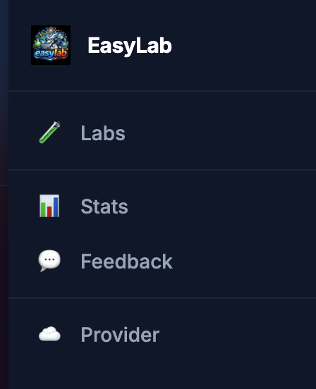
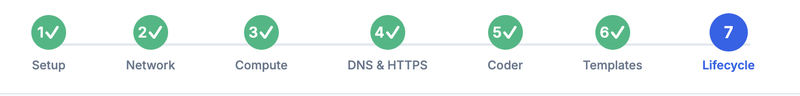
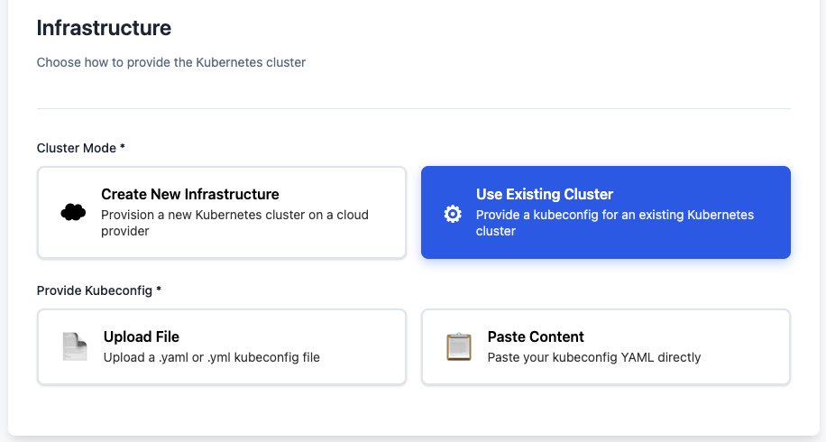
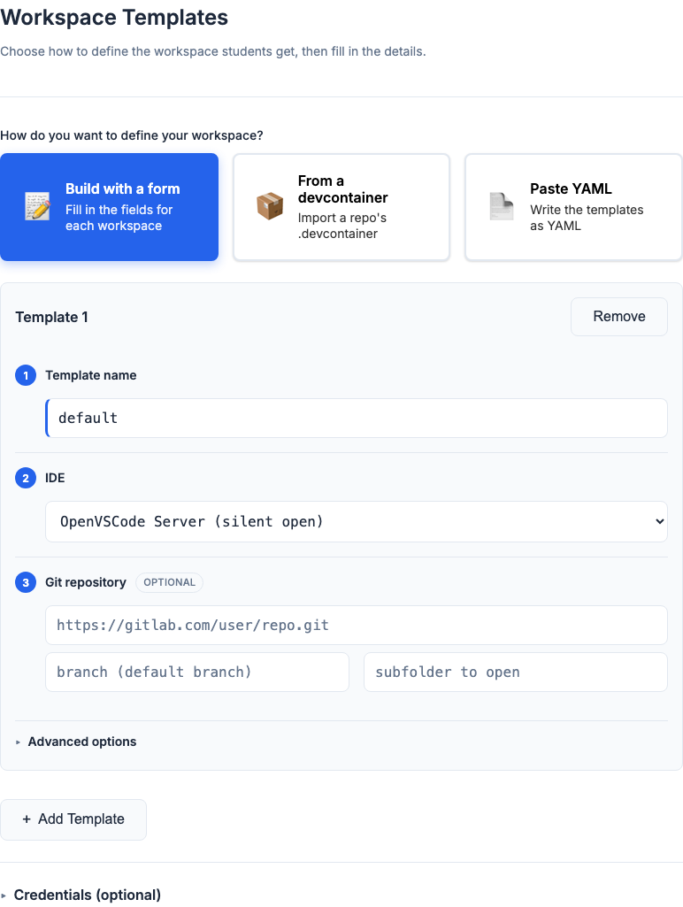
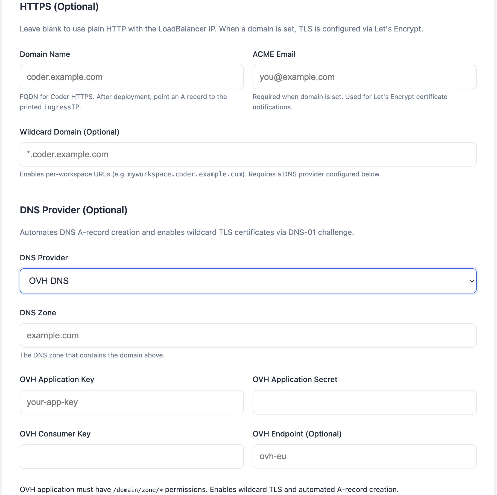
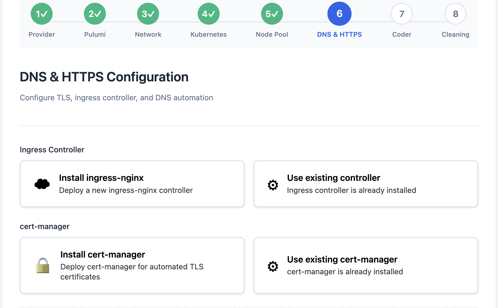
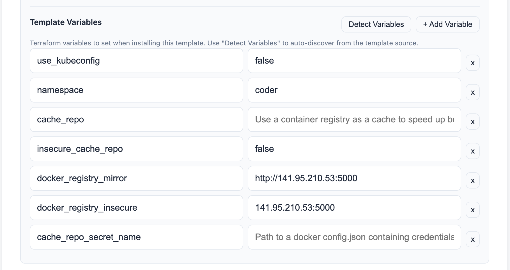
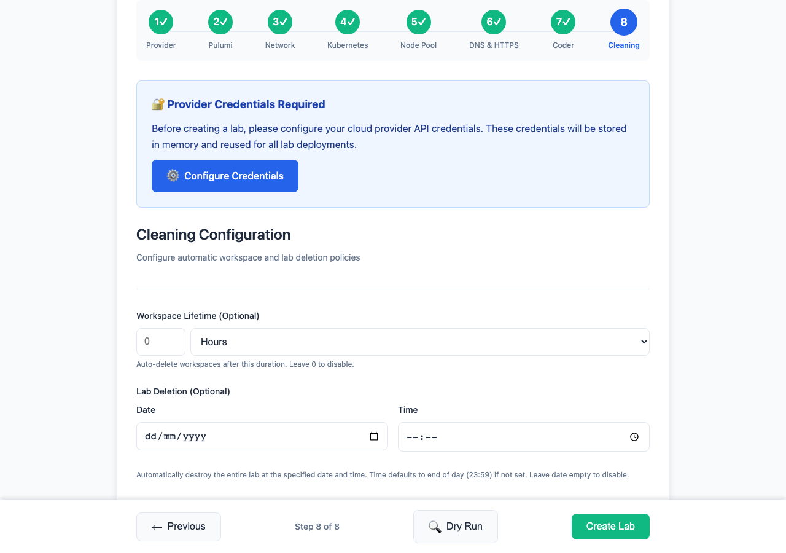
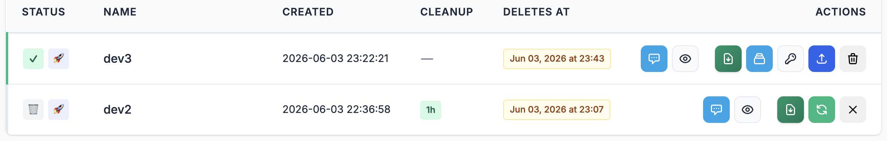
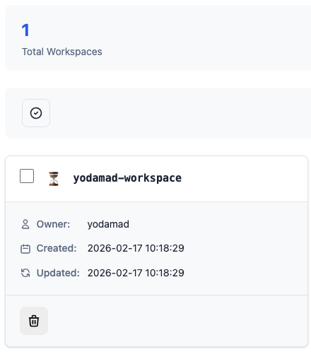

# Admin Space

{ width=200 }

As an admin (trainer, speaker, ...), you have access to the admin space to manage your labs:

* [x] Create a new lab
* [x] Define multiple workspace templates per lab (students get one workspace per template)
* [x] Dry run (preview) a lab before creating it
* [x] Set/update credentials for the cloud providers
* [x] Manage your labs
    * [x] See logs
    * [x] Retrieve workspace access info (base URL, namespace) for completed labs
    * [x] Delete a lab
    * [x] Recreate a destroyed lab with the same configuration
    * [x] List workspaces
    * [x] Delete workspaces (one by one or in bulk)
    * [x] Retry a failing lab installation
* [x] View student feedback per lab (rating, difficulty, comments)
* [x] View deployment statistics (KPIs, monthly chart, per-project breakdown)
* [x] Configure automatic workspace and lab deletion (cleaning policies)

## Create a new lab



First you need to choose how to provide the Kubernetes cluster:

* [x] [Create New Infrastructure](#on-ovhcloud) — Provision a new cluster on a cloud provider (OVHcloud)
* [x] [Use Existing Cluster](#use-existing-cluster) — Provide a kubeconfig for an existing Kubernetes cluster

{width=350}

### Use Existing Cluster

When you choose **Use Existing Cluster**, EasyLab skips cloud provider provisioning and uses your own Kubernetes cluster. This is useful when you already have a cluster (e.g. from your organization, a local dev environment, or another cloud provider).

**What you need to provide:**

* **Kubeconfig** — Either:
    * Upload a `.yaml` or `.yml` kubeconfig file, or
    * Paste the kubeconfig YAML content directly

**What is skipped:**

* No cloud provider credentials required
* No network, cluster, or node pool configuration
* The wizard goes directly to workspace and template configuration

The kubeconfig must have sufficient permissions to create namespaces, Deployments, Services, Ingresses and PersistentVolumeClaims, and (when a domain is set) to install the ingress-nginx and cert-manager Helm releases.

### On OVHcloud (Create New Infrastructure)

When creating new infrastructure, you choose OVHcloud as the cloud provider. Most of the configuration is preconfigured; you only need to select the ID for the private network.

??? info "Others parameters can be overridden if needed"

    | Category | Parameter                       | Description                                              |
    |----------|----------------------------------|---------------------------------------------------------|
    | Network | | |
    | | Gateway Name             | The name of the network gateway                          |
    | | Gateway Model            | The model of the network gateway                         |
    | | Private Network Name     | The name of the network private network                  |
    | | Region                   | The region of the network                                |
    | | Mask                     | The mask of the network                                  |
    | Node Pool | | |
    | | Name                   | The name of the node pool                                |
    | | Flavor                 | The flavor of the node pool                              |
    | | Desired Node Count     | The desired number of nodes in the node pool             |
    | | Min Node Count         | The minimum number of nodes in the node pool             |
    | | Max Node Count         | The maximum number of nodes in the node pool             |

### Configure workspaces

Student workspaces run as **OpenVSCode Server** pods provisioned directly on the
lab's Kubernetes cluster — there is no separate IDE server or database to
configure. On the **Workspace** step you only set:

* **Workspace Namespace** (optional) — the Kubernetes namespace student
  workspaces are created in. Defaults to `workshops`.

Then, on the **Templates** step, you define **one or more** workspace templates
for the lab. Each template is a different workspace flavor that students can
choose when requesting a workspace.



At the top of the step you choose **how** to define the workspace:

* **Build with a form** — fill in the fields for each template (the default).
* **From a devcontainer** — import a workshop repository's `.devcontainer`; see
  [Workshops with a devcontainer](#workshops-with-a-devcontainer).
* **Paste YAML** — edit the templates as YAML directly; see
  [Editing templates as YAML](#editing-templates-as-yaml).

With **Build with a form**, each template shows three **essentials** up front and
tucks the rest behind **Advanced options**, so simple labs stay simple. Use **Add
Template** to define additional templates.

The **essentials**:

* **Template name** — Name shown in the student template selector.
* **IDE** — the IDE base:
    * **OpenVSCode Server** (`gitpod/openvscode-server`) — opens **silently** via a token in the URL; smaller image; runs as a **non-root** user, so a startup script **cannot** `apt-get install` system packages.
    * **code-server** (`codercom/code-server`) — has passwordless **sudo/apt**, so startup scripts can install system packages; the student authenticates on a **login page** with the password shown in the portal.
* **Git Repository** (optional) — a repo cloned into the workspace on first start (a persistent volume is provisioned automatically). The **branch** field clones a specific branch; **subfolder** opens a subdirectory of the repo.

Under **Advanced options** (all optional):

* **Git credential** — the credential (from the **Credentials** section below) that unlocks a **private** Git Repository. Define a single git credential and it is wired into every template with a private repo automatically; add more than one and pick the right one per template here.
* **Image** — a container image override. Defaults to the selected IDE's image.
* **CPU / Memory / Disk Size** — resource requests for the workspace pod (e.g. `500m`, `1Gi`, `5Gi`).
* **Startup Script** — shell commands run (best-effort) on start, *before* the IDE opens: install tools, configure the shell, run a bootstrap. Failures are shown in `kubectl logs` but never block the workspace from opening.
* **Dotfiles Repository** — cloned to `~/.dotfiles`; its `install.sh` / `setup.sh` / `bootstrap.sh` is run if present.
* **Extensions** — comma-separated VS Code extension IDs installed on start.
* **Environment Variables** — passed to the workspace container.
* **Sidecars** — extra containers in the workspace pod (name / image / ports / env), reachable from the IDE at `localhost:<port>` — e.g. a `postgres:16` database. Each sidecar can also be marked **privileged** and given extra **capabilities** (e.g. `SYS_ADMIN`) — needed to run **docker-in-docker** (see below).
* **Mounts** — mount an existing **ConfigMap** or **Secret** into the workspace container. The referenced object **must already exist** in the workspace namespace, or the pod won't start.

If no template is defined, a `default` OpenVSCode Server workspace is used.
Students can request **one workspace per template** within a lab, so multiple
templates let them get multiple workspaces in the same environment.

A template can also build its workspace from a workshop repository's
`devcontainer.json` instead of an **Image** — see
[Workshops with a devcontainer](#workshops-with-a-devcontainer).

#### Editing templates as YAML

At the top of the **Templates** step, pick **Paste YAML** to edit the lab's
workspace templates directly instead of filling in the form — useful for labs
with several templates, for reusing a previous workshop, or for keeping the
configuration in a git repository.

```yaml
workspace_templates:
  - name: go-workshop
    ide: code-server
    image: codercom/enterprise-base:ubuntu
    git_repo: https://gitlab.com/user/workshop.git
    git_branch: main
    git_folder: exercises
    cpu: "2"
    memory: 4Gi
    disk_size: 10Gi
    startup_script: |
      sudo apt-get update && sudo apt-get install -y jq
    dotfiles_repo: https://github.com/you/dotfiles
    extensions:
      - golang.go
    env:
      DOCKER_HOST: tcp://localhost:2375
    sidecars:
      - name: db
        image: postgres:16
        ports: [5432]
        env:
          POSTGRES_PASSWORD: postgres
        privileged: false
        capabilities: [SYS_ADMIN]
    mounts:
      - type: configmap   # configmap | secret
        name: my-config
        path: /etc/config
  - name: minimal
```

The keys are exactly the fields described above, and only `name` is required.

* **Switching to Paste YAML** seeds the editor from whatever the form currently
  holds, so you can fill in the easy parts first and then hand-edit. With nothing
  filled in yet you get a commented skeleton listing every supported key.
* **YAML is authoritative.** While **Paste YAML** is selected, the form fields are
  ignored when the lab is created — switching back to **Build with a form** does
  *not* carry your YAML edits over.
* **Validate** checks the document without creating anything. Unknown keys are
  rejected rather than ignored, so a typo like `imagee:` is reported instead of
  silently dropping the image from the lab.
* **Insert skeleton** replaces the editor with the commented template, and
  **Upload file** loads a `.yaml` file from disk.
* Invalid YAML fails the lab creation itself, so a broken document can never
  produce a half-configured lab.

To reuse the templates from an existing lab, use **Export Templates YAML** on the
[labs list](#manage-your-labs) to download its `workspace-templates-<stack>.yaml`,
then load it with **Upload file**. Only the templates are exported — credentials
are never included.

See [Workspace template examples](templates.md) for complete, copy-pasteable
documents: git-backed workshops, database sidecars, docker-in-docker, mounts, and
the gotchas each one comes with.

#### Workshops with a devcontainer

If the workshop repository already ships a `.devcontainer/devcontainer.json`, a
template can build the workspace from it instead of naming an **Image**. The
devcontainer is built inside each student's workspace on first start, so the
workshop's own `Dockerfile` and `features` work as written.

Choose **From a devcontainer** at the top of the **Templates** step:

1. Choose **Git repository** (EasyLab clones the repo and finds the
   `devcontainer.json`) or **Upload** (a `devcontainer.json`, or a repository
   `.zip`).
2. Fill in the **Cache registry**. If the devcontainer builds from a **private
   base image** or pushes to a **private cache**, add a registry credential in the
   **Credentials** section and choose it under **Registry credential for students**
   — with a single registry credential it is applied automatically. envbuilder
   pulls the base image (and pushes the cache) inside each student's pod with it;
   without it the pull falls back to anonymous and the build fails.
3. If the workshop repository is **private**, add a git token in the **Credentials**
   section and choose it under **Git credential for students** — with a single git
   credential it is applied automatically — so each student's workspace can clone
   it. (The **Access token** field is separate — it only reads the devcontainer
   during import and is discarded.)
4. Click **Import**. EasyLab turns the devcontainer into a workspace template and
   lists anything in it that will not take effect.
5. Click **Review generated YAML** to open the result in the editor, adjust it if
   needed, then finish the wizard.

The import is a starting point, not a black box — what it produces is ordinary
template YAML you can change.

The **IDE** picker applies here as it does for a hand-built template: the image
the devcontainer builds carries no IDE, so the one you choose is injected into
it. This is independent of the devcontainer's own base image, with one catch —
that base must be **glibc**-based, since neither IDE's bundled Node runs on
Alpine/musl. If the workspace container exits with `no such file or directory`,
this is why.

!!! danger "A cache registry is required"
    Devcontainer templates must set `cache_repo`. Layers are cached there and
    pushed after the first build, so the first workspace pays for the build and
    the rest start from the cache. Without it every student rebuilds the whole
    devcontainer from scratch, which turns a seconds-long start into a
    minutes-long one for each of them.

    Create the credentials Secret in the workspace namespace beforehand:

    ```bash
    kubectl create secret docker-registry regcred \
      --docker-server=registry.example.com \
      --docker-username=<user> \
      --docker-password=<token> \
      --namespace=workshops
    ```

    Then choose it under **Registry credential for students** (or leave the picker
    on **Auto** if it is your only registry credential). A public cache registry
    with a public base image needs no Secret.

!!! warning "Not every devcontainer can be used"
    Devcontainers built on **docker-compose** (`dockerComposeFile`) are rejected:
    the workspace is built as a single image, not a set of orchestrated services.
    A hand-written `sidecars:` block is the nearest equivalent. `forwardPorts`,
    `mounts`, `privileged` and `postStartCommand` are also not applied — the
    import lists them so you can decide what to do. See
    [Devcontainer workshops](templates.md#devcontainer-workshops) for the full
    breakdown of what is honoured.

!!! tip "Installing system tools"
    Startup scripts run as the workspace user. On **code-server** you can `sudo apt-get install …`; on **OpenVSCode Server** (non-root) you can't — bake system packages into a **custom image** instead and set it as the template **Image**:

    ```dockerfile
    FROM gitpod/openvscode-server:latest
    USER root
    RUN apt-get update && apt-get install -y golang nodejs && rm -rf /var/lib/apt/lists/*
    USER openvscode-server
    ```

    Build, push to a registry your cluster can pull from, and set **Image** to it. The same pattern works `FROM codercom/code-server:latest`.

!!! tip "Docker inside a workspace (docker-in-docker)"
    Managed clusters (OVHcloud, AKS) run **containerd**, not Docker, so there is no host Docker socket to reuse. To give students a working `docker`, run a **Docker-in-Docker sidecar** and point the workspace CLI at it:

    * **Sidecar** — name `docker`, image `docker:dind`, port `2375`, env `DOCKER_TLS_CERTDIR=` (empty, disables TLS), **privileged** ✅ (dind requires it; capability `SYS_ADMIN` alone is not enough for full dind).
    * **Env** (on the template) — `DOCKER_HOST=tcp://localhost:2375`.
    * **Startup Script** — install the CLI (use a `code-server` template so `sudo` is available):

    ```bash
    sudo apt-get update && sudo apt-get install -y docker.io
    until docker info >/dev/null 2>&1; do sleep 2; done
    ```

    Each workspace then gets its **own isolated** Docker daemon. ⚠️ Privileged containers can escalate to the node — only enable this on a trusted workshop cluster you control. For an unprivileged alternative, use `docker:dind-rootless` with the right capabilities, or install a Sysbox/Kata RuntimeClass on the cluster.

#### HTTPS Configuration (Optional)

A domain is optional. Without one, workspaces are still reachable — EasyLab falls
back to [nip.io](https://nip.io) wildcard DNS over the ingress controller's
LoadBalancer IP, serving each workspace at `http://{workspace}.{ingressIP}.nip.io`.
That needs no DNS setup at all, which makes it convenient for quick or throwaway
labs, but it is **plain HTTP with no TLS** — set a domain for anything real.

* **Domain Name** — the base FQDN for the lab (e.g. `lab.example.com`). Each student workspace gets a subdomain (`{workspace}.{domain}`), served over HTTPS. Leave blank to use the nip.io fallback described above.
* **ACME Email** — email address used for Let's Encrypt certificate notifications. Required when domain is set.
* **Wildcard Domain** — optional, e.g. `*.lab.example.com`. Creates the wildcard DNS A-record so per-student subdomains resolve (requires a DNS provider configured below).



The following components are deployed into the cluster:

* **ingress-nginx** — Kubernetes ingress controller (gets its own LoadBalancer IP, exported as `ingressIP`). Installed whether or not a domain is set, since the nip.io fallback routes through it too.
* **cert-manager** — automates TLS certificate issuance from Let's Encrypt. Installed only when a domain is set; the nip.io fallback has no certificates to issue.

!!! note "The nip.io fallback needs a routable LoadBalancer IP"
    nip.io resolves an IP embedded in the hostname, so the fallback only applies when
    the ingress controller has an external **IP**. On a cluster whose LoadBalancer
    exposes a hostname instead, or with no ingress controller, workspaces stay
    cluster-internal and the lab's base URL shows as empty.



After `pulumi up` completes, the stack output `ingressIP` is printed. **You must create a DNS A record** pointing `<domain> → <ingressIP>` in your DNS provider before the TLS certificate can be issued.

!!! warning "TLS certificates and large labs"
    Each student workspace obtains its **own** Let's Encrypt certificate for its
    subdomain. Let's Encrypt limits issuance to about **50 certificates per week per
    registered domain**, so a large lab (many students × templates) can exceed the
    limit and some workspaces will fail to get TLS. Mitigations:

    * Keep labs modest, or spread them across more than one domain.
    * Use the Let's Encrypt **staging** issuer while testing (no rate limit; browsers show an untrusted cert).
    * Front the lab with a **wildcard** certificate for `*.<domain>` (issued via DNS-01) so all workspaces share one certificate instead of one each.

!!! note "Opening a workspace"
    A workspace only shows the **Open** button once its IDE is actually serving (a
    readiness probe gates it), so a workspace running a long startup script stays in
    the "starting" state until setup finishes — avoiding a connection-refused click.

#### DNS Provider (Optional)

Select a DNS provider to automate A-record creation and unlock wildcard certificates (DNS-01 challenge):

| Provider | Setup required |
|----------|---------------|
| **OVH DNS** | OVH application key, secret, and consumer key with `/domain/zone/*` permissions |
| **Azure DNS** | Azure service principal with `DNS Zone Contributor` role on the DNS zone resource group |

!!! warning "DNS Zone is required"
    When you select a DNS provider you **must** fill in the **DNS Zone** field with the parent zone that hosts your domain — for example, domain `ai-bb.yodamad.fr` belongs to zone `yodamad.fr`. The domain must sit inside the zone. Leaving the zone empty (or entering a zone the domain is not part of) is rejected as soon as you submit the form, before any infrastructure is provisioned.

When a DNS provider is configured:

1. EasyLab automatically creates the A record `<domain> → <ingressIP>` during deployment.
2. cert-manager uses DNS-01 (instead of HTTP-01) to prove domain ownership, which supports wildcard certificates.
3. The wildcard A record `*.<domain>` is also created if a **Wildcard Domain** is set.

!!! note "OVH DNS credentials"
    The OVH credentials for DNS management may differ from your cloud project credentials. Create a separate OVH application at <https://www.ovh.com/auth/api/createApp> with access to the `/domain/zone/*` endpoints.

!!! note "Azure DNS credentials"
    Create a service principal (`az ad sp create-for-rbac`) and assign it the `DNS Zone Contributor` role on the resource group that contains your Azure DNS zone. Azure DNS uses cert-manager's native solver — no additional webhook is required.

### Environment Variables

Each workspace template can define environment variables passed to the workspace container.

**Manual entry** — Click **+ Add Variable** on a template row to add an environment variable name and value.



### Cleaning Configuration (Step 8)

The last step of the wizard lets you configure automatic cleanup policies for both workspaces and the entire lab.

{width=700}

#### Workspace Lifetime

Set **Workspace Lifetime** (with a unit of Hours or Days) to automatically delete student workspaces after a given duration. The cleanup service checks at a regular interval (default 5 minutes, configurable via `CLEANUP_INTERVAL_MINUTES`) and deletes any workspace whose creation time exceeds the limit.

Leave the field at `0` or leave it empty to disable automatic workspace cleanup.

#### Lab Deletion

Set a **Date** (and optionally a **Time**) for the entire lab to be automatically destroyed. When the scheduled date/time is reached, EasyLab runs `pulumi destroy` on the lab without any manual action.

* If only a date is set, the lab is destroyed at 23:59 that day.
* Leave the date empty to disable scheduled lab deletion.

!!! note
    The cleanup service also runs scheduled lab deletion checks at the same interval as workspace cleanup. Set `CLEANUP_INTERVAL_MINUTES` to a lower value if you need finer-grained precision (default is 5 minutes).

## Dry run (preview before create)

Before creating a lab, you can run a **dry run** to preview what Pulumi would do without actually provisioning resources. This is useful to validate configuration and catch errors early.

1. Complete the lab creation wizard up to the final step.
2. Click **Dry Run** instead of **Create Lab**. EasyLab runs `pulumi preview` and shows the planned changes.
3. If the dry run succeeds, the job appears in the labs list with status **dry-run-completed** (🔍).
4. From the labs list, you can then **Create Lab** on that job to perform the real deployment with the same configuration.

Dry-run jobs do not create any cloud or Kubernetes resources; only real runs do.

## Provider credentials

Cloud provider credentials and options are accessed from the **Provider** dropdown in the header. It contains two entries:

* **OVH** — opens the OVH configuration page (`/admin/ovh-options`)
* **Azure** — opens the Azure configuration page (`/admin/azure-options`)

Each provider page has two tabs:

* **Credentials** — enter and save the API credentials for the provider. Credentials are stored in memory only and are cleared on application restart. When using **Use Existing Cluster**, no cloud credentials are required.
* **Options** — configure available regions and compute flavors/VM sizes for the lab creation wizard. Use **Refresh** to fetch the latest data from the provider API.

For OVHcloud-specific setup, see [OVHcloud configuration](ovhcloud.md). For Azure-specific setup, see [Azure configuration](azure.md).

## Manage your labs

Clicking on the `Labs` button in the header will redirect you to the labs list page. The **Provider** dropdown is available on every admin page and navigates directly to the OVH or Azure configuration page.

{width=850}

You can see all the labs you have created with following information:

* **Status** — created, running, completed, failed, destroyed, or dry-run-completed (preview-only)
* **Creation date**
* **Type** — Real run (🚀) or Dry run (🔍)
* **Access to the creation logs**
* **Access to the kubeconfig file** (for completed labs)
* **Workspace access** — For completed labs, a **Workspace access** button opens a modal with the lab's base URL and the namespace student workspaces run in.
* **Actions** — Destroy a lab; **Recreate** a destroyed lab with the same configuration (same workspace templates, options, etc.)
* **List of workspaces** created for this lab — delete workspaces one by one or in bulk
* **Cleanup** - Display the cleanup policy for the lab (*i.e. after how many hours/days the workspaces will be deleted*)

{width=350}

## Lab credentials (private registries and repositories)

A lab whose workspaces use a private image or clone a private repository needs
credentials. Add them at either of two points:

* **During creation** — the **Workspace Templates** step of the wizard has a
  *Credentials* section. Tokens entered there are held in memory and written to the
  cluster the moment it finishes provisioning, before the lab reports ready.
* **After the lab is up** — expand **Credentials** on the lab's **Workspaces** page.

Two kinds:

* **Container registry** — a server, username and token. Referenced from a
  workspace template as `image_pull_secrets`, and by a devcontainer template as
  `devcontainer.registry_auth_secret`.
* **Git repository** — a username and token. Referenced from a workspace template
  as `git_auth_secret`. In the wizard's **Build with a form** path a single git
  credential is wired into every template with a private repo automatically; with
  several, pick the one each template uses under its **Advanced options → Git
  credential**. Leave the username blank and it defaults to `oauth2`, which is what
  GitLab expects with a personal access token.

The panel shows the exact line to paste into your template, and lists credentials
created out of band with `kubectl` alongside the ones added here.

How the token is handled, and what follows from it:

* **It is written straight to the lab's cluster and not kept by EasyLab.** It is
  never stored in the lab configuration, so it cannot appear in the job file, the
  jobs API, or the templates export — a template names a credential, it never
  contains one.
* **The Secret lives in the cluster.** Entered in the wizard, a token waits in
  memory only until provisioning finishes; entered on the Workspaces page, it is
  written immediately. Either way EasyLab keeps no copy — which is why a wizard
  token is lost if the server restarts mid-provisioning, and the lab then shows the
  credential as pending rather than failing a student first.
* **Destroying a lab destroys its credentials.** Recreating a lab prompts you to
  re-enter the tokens, with the names and types carried over; a retried lab keeps
  them.
* **Saving over a name rotates it.** Running workspaces keep the old token until
  they are recreated.
* **A referenced-but-missing credential is flagged.** If a template names a
  credential the cluster does not have, the Credentials panel says which one.

Full reference, including the `kubectl` equivalents and the difference between
`image_pull_secrets` and `devcontainer.registry_auth_secret`, is in
[Workspace templates](templates.md#private-registries-and-repositories).

## Workspace access

Each student workspace is an OpenVSCode Server pod exposed (when a domain is
configured) at `https://{workspace}.{domain}/`. Access is gated by a per-student
**connection token** that EasyLab generates and shows to the student on the
portal. There is no separate IDE login: the token is appended to the workspace
URL (`?tkn=…`) when the student opens their workspace, and EasyLab's own student
authentication protects the portal itself.
