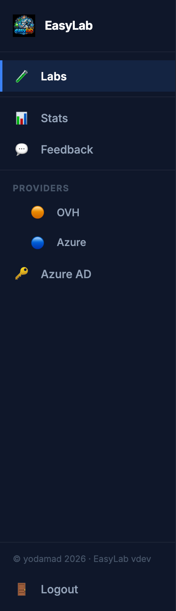

# Admin Space

{ width=200 }

As an admin (trainer, speaker, ...), you have access to the admin space to manage your labs:

* [x] [Create a new lab](admin-lab-creation.md)
* [x] Define multiple workspace templates per lab (students get one workspace per template)
* [x] Dry run (preview) a lab before creating it
* [x] Set/update credentials for the cloud providers
* [x] [Manage your labs](admin-lab-management.md)
    * [x] See logs
    * [x] Retrieve endpoint info (workspace base URL, namespace) for completed labs
    * [x] Delete a lab
    * [x] Recreate a destroyed lab, either as-is or with an edited configuration
    * [x] List workspaces
    * [x] Delete workspaces (one by one or in bulk)
    * [x] See a workspace creation/deletion history per lab, with owner and template
    * [x] Export a lab's workspace history to CSV
    * [x] Retry a failing lab installation, either as-is or with an edited configuration
* [x] View student feedback per lab (rating, difficulty, comments)
    * [x] Export a lab's feedback to CSV
* [x] View deployment statistics (KPIs, monthly chart, per-project breakdown)
* [x] Configure automatic workspace and lab deletion (cleaning policies)
* [x] View an audit log of lab, workspace, and credential actions ([details](audit-log.md))

Every admin page shows the EasyLab copyright and version in the sidebar footer. The version reflects the latest Git tag the binary was built from (`dev` for local/untagged builds).

## Login

Admin login uses the password set via `LAB_ADMIN_PASSWORD` (or Azure AD, if configured — see [Azure AD authentication](azure-ad.md)). After 5 failed password attempts, further attempts from the same client are locked out for 15 minutes as a brute-force protection.

## Provider credentials

Cloud provider credentials and options are accessed from the **Provider** dropdown in the header. It contains two entries:

* **OVH** — opens the OVH configuration page (`/admin/ovh-options`)
* **Azure** — opens the Azure configuration page (`/admin/azure-options`)

Each provider page has two tabs:

* **Credentials** — enter and save the API credentials for the provider. Credentials are stored in memory only and are cleared on application restart; they are **never written to lab state on disk**. Because of this, they are re-read from the in-memory store whenever a lab is destroyed, recreated, or retried, so the credentials must be available at that time (for example provided via the `OVH_*` / `AZURE_*` environment variables so they survive a restart). When using **Use Existing Cluster**, no cloud credentials are required.
* **Options** — configure available regions and compute flavors/VM sizes for the lab creation wizard. Use **Refresh** to fetch the latest data from the provider API.

For OVHcloud-specific setup, see [OVHcloud configuration](ovhcloud.md). For Azure-specific setup, see [Azure configuration](azure.md).

## Where to go next

* [Creating a Lab](admin-lab-creation.md) — the lab creation wizard: infrastructure, workspace templates, HTTPS/DNS, and cleaning policies.
* [Managing Labs](admin-lab-management.md) — the labs list, the lab detail page, retry/recreate, templates on a lab, pre-baking, workspace history, and lab credentials.
