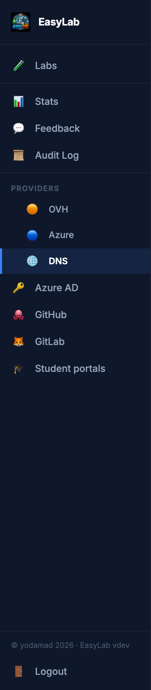
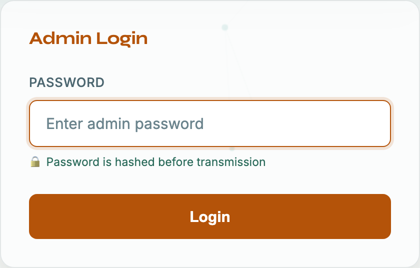
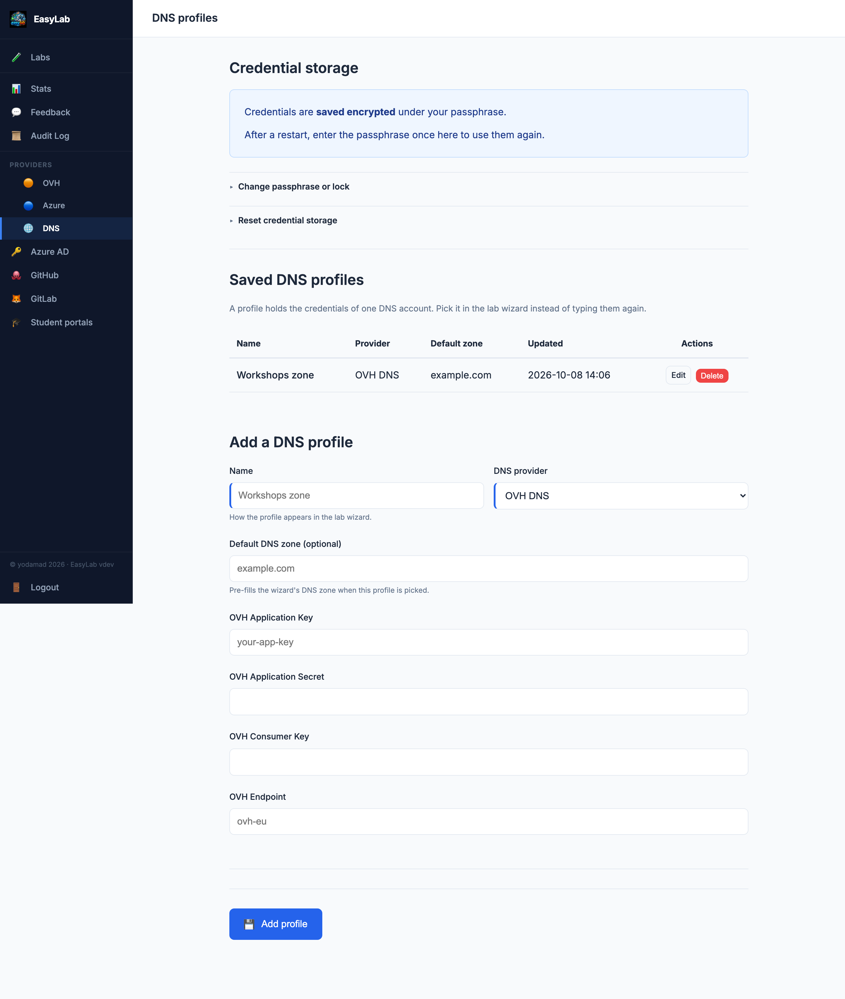

# Admin Space

{ width=200 }

As an admin (trainer, speaker, ...), you have access to the admin space to manage your labs:

* [x] [Create a new lab](admin-lab-creation.md)
* [x] Define multiple workspace templates per lab (students get one workspace per template)
* [x] Dry run (preview) a lab before creating it
* [x] Set/update credentials for the cloud providers
* [x] [Manage your labs](admin-lab-management.md)
    * [x] See logs
    * [x] Retrieve endpoint info (workspace base URL, namespace) for completed labs
    * [x] Delete a lab
    * [x] Recreate a destroyed lab, either as-is or with an edited configuration
    * [x] List workspaces
    * [x] Delete workspaces (one by one or in bulk)
    * [x] See a workspace creation/deletion history per lab, with owner and template
    * [x] Export a lab's workspace history to CSV
    * [x] Retry a failing lab installation, either as-is or with an edited configuration
* [x] View student feedback per lab (rating, difficulty, comments)
    * [x] Export a lab's feedback to CSV
* [x] View deployment statistics (KPIs, monthly chart, per-project breakdown)
* [x] Configure automatic workspace and lab deletion (cleaning policies)
* [x] View an audit log of lab, workspace, and credential actions ([details](audit-log.md))

Every admin page shows the EasyLab copyright and version in the sidebar footer. The version reflects the latest Git tag the binary was built from (`dev` for local/untagged builds).

## Login

Admin login uses the password set via `LAB_ADMIN_PASSWORD` (or Azure AD, if configured — see [Azure AD authentication](azure-ad.md)). After 5 failed password attempts, further attempts from the same client are locked out for 15 minutes as a brute-force protection.

The login page follows your system's light or dark preference; the sun/moon button in the top-right corner switches theme, and the choice is shared with the homepage.

{ width=300 }

Student login can additionally be opened to Microsoft accounts ([Azure AD authentication](azure-ad.md)) GitHub accounts ([GitHub login](github.md)), or GitLab accounts on gitlab.com or a self-managed instance ([GitLab login](gitlab.md)); each is configured from its own entry in the admin sidebar.

## Provider credentials

Cloud provider credentials and options are accessed from the **Provider** dropdown in the header. It contains two entries:

* **OVH** — opens the OVH configuration page (`/admin/ovh-options`)
* **Azure** — opens the Azure configuration page (`/admin/azure-options`)

Each provider page has two tabs:

* **Credentials** — enter and save the API credentials for the provider. Credentials are **never written to lab state on disk**: they are re-read from the credential store whenever a lab is destroyed, recreated, or retried, so they must be available at that time. By default they are kept in memory only and cleared on application restart; to keep them across restarts, either set up [credential storage](#credential-storage) or provide them through the `OVH_*` / `AZURE_*` environment variables. When using **Use Existing Cluster**, no cloud credentials are required.
* **Options** — configure available regions and compute flavors/VM sizes for the lab creation wizard. Use **Refresh** to fetch the latest data from the provider API.

For OVHcloud-specific setup, see [OVHcloud configuration](ovhcloud.md). For Azure-specific setup, see [Azure configuration](azure.md).

## Credential storage

EasyLab can keep cloud provider credentials and [DNS profiles](#dns-profiles) across restarts, encrypted with AES-256-GCM. It only ever does so under a key that is **not stored next to the data**, so a leaked data volume or backup does not expose them. The **Credential storage** card at the top of the **DNS** page (and of `/credentials`) shows which of these applies:

| What you see | Meaning |
|--------------|---------|
| **In memory only** | Nothing is saved. Credentials are cleared when EasyLab restarts. This is the default. |
| **Saved encrypted under your passphrase** | You set a passphrase on this page. It is never written to disk: after a restart the card shows **locked**, and you enter the passphrase once to get every saved credential back. |
| **Saved encrypted under `LAB_DATA_ENCRYPTION_KEY`** | The key is set in the environment, so saved credentials are available again automatically after a restart. No passphrase is involved. |
| **Cannot be read** | The credentials were saved under a `LAB_DATA_ENCRYPTION_KEY` that is no longer set (or the file is damaged). Restart with the original key, or reset. |

To start saving credentials, either:

* **Set a passphrase** — on the **DNS** page, type a passphrase of at least 12 characters twice and click **Save credentials encrypted**. Whatever you already entered in this session is saved with it. The passphrase cannot be recovered if lost.
* **Set `LAB_DATA_ENCRYPTION_KEY`** in the environment (see [Docker — Environment Variables](docker.md#environment-variables)). This suits unattended deployments: nobody has to unlock anything after a restart.

The key EasyLab generates by itself in `<DATA_DIR>/.encryption_key` when `LAB_DATA_ENCRYPTION_KEY` is unset is deliberately **not** used for this, because it sits beside the data it would protect.

While credential storage is **locked**:

* Saved cloud credentials and DNS profiles are unavailable; the lab wizard says so and links to the DNS page.
* Existing labs are unaffected. Each lab carries its own copy of the DNS credentials it was created with, so retry and destroy on a BYO-cluster lab keep working. Operations that need cloud credentials (destroy, recreate, automatic lab deletion on a provisioned cluster) wait until you unlock, exactly as they waited for credentials to be re-entered before.
* Five wrong passphrases in a row pause unlocking for one minute.

Under **Change passphrase or lock** you can change the passphrase (the current one is required) or **Lock now**. Locking makes saved DNS profiles unavailable until the next unlock; cloud credentials already loaded stay in memory until EasyLab restarts.

**Reset credential storage** deletes every saved cloud credential and DNS profile. It is the only way out of a forgotten passphrase. Type `RESET` to confirm.

!!! note "Saved credentials take precedence over environment variables"
    If credentials are both provided through `OVH_*` / `AZURE_*` variables and saved from the UI, the saved ones are used once credential storage is open.

## DNS profiles

A DNS profile is a named, saved set of DNS provider credentials. Create one per DNS account (or per zone) on the **DNS** page in the sidebar, then pick it in the lab wizard instead of typing the credentials for every lab.

To add a profile:

1. Open **DNS** in the admin sidebar.
2. Under **Add a DNS profile**, enter a **Name** — this is what the lab wizard shows.
3. Choose the **DNS provider** (OVH DNS or Azure DNS). The credential fields for that provider appear.
4. Optionally enter a **Default DNS zone**; it pre-fills the wizard's DNS zone when the profile is picked.
5. Fill in the credentials and click **Add profile**.

The credentials required are the same as in the wizard — see [OVH DNS and Azure DNS credentials](admin-lab-creation.md#externaldns-optional).

**Edit** changes a profile. Secret fields are never shown again: leave them blank to keep the saved value, or type a new one to replace it. **Delete** removes the profile. Neither affects labs already created, which keep the credentials they were created with — to move an existing lab to new credentials, retry or recreate it with the profile selected.

Profiles follow the [credential storage](#credential-storage) rules above: without a passphrase or `LAB_DATA_ENCRYPTION_KEY` they last until EasyLab restarts.

## Where to go next

* [Creating a Lab](admin-lab-creation.md) — the lab creation wizard: infrastructure, workspace templates, HTTPS/DNS, and cleaning policies.
* [Managing Labs](admin-lab-management.md) — the labs list, the lab detail page, retry/recreate, templates on a lab, pre-baking, workspace history, and lab credentials.
