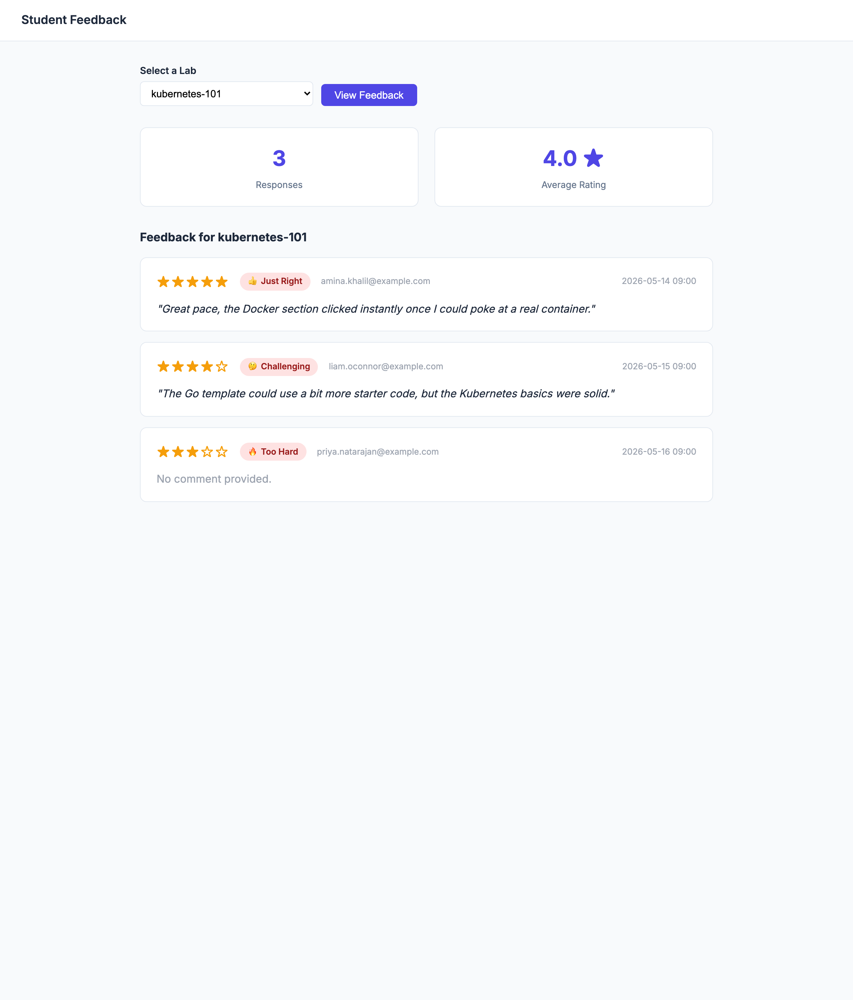

# Student Feedback

EasyLab collects feedback from students after each lab session. Admins can review the aggregated results per lab.

## Viewing feedback

Navigate to **Feedback** in the admin header. Select a lab from the dropdown and click **View Feedback** — or, from a lab's own [detail page](admin-lab-management.md#the-lab-detail-page), open its **Feedback** section and click **View all feedback →**, which lands here pre-filtered to that lab.

The page shows:

* **Response count** — total number of feedback submissions for the selected lab
* **Average rating** — mean star rating across all submissions
* **Individual entries** — one card per submission, displaying:
    * Star rating (1–5)
    * Difficulty level (Too Easy / A Bit Easy / Just Right / Challenging / Too Hard)
    * Free-text comment (if provided)
    * Submission date and time

If no feedback has been submitted yet, an empty state is displayed.

{width=45%}

## Exporting feedback

When a selected lab has at least one response, an **Export CSV** button appears above the entries. It downloads the full feedback for that lab as a `feedback-<lab>.csv` file — one row per submission (email, rating, difficulty, recommendation, comment, and submission time) — handy for record-keeping or analysis outside the admin UI.