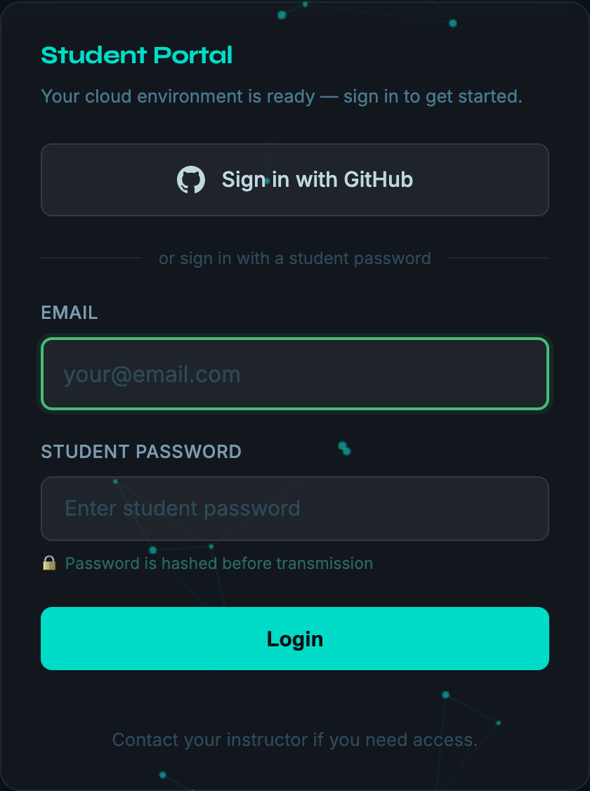
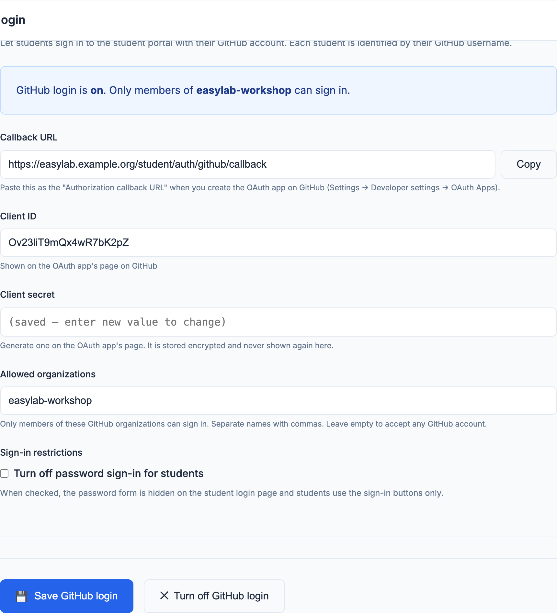

# GitHub login (optional)

EasyLab can let **students** sign in to the student portal with their GitHub account, instead of (or in addition to) the shared student password. Admin login is not affected.

---

## How it works

When enabled, a **Sign in with GitHub** button appears on the student login page.

1. The student clicks **Sign in with GitHub** and is redirected to GitHub to authorize the EasyLab OAuth app.
2. EasyLab reads the student's GitHub username. If you restricted sign-in to organizations, it also checks that the student is an active member of at least one of them.
3. EasyLab creates a local session. The student is identified as `<username>@users.noreply.github.com`, so their workspaces are owned by their GitHub username.

{ width=300 }

EasyLab never reads the student's email address, repositories, or anything else from the account. It requests no OAuth scope at all, or `read:org` only when an organization restriction is set. The GitHub token is used once during sign-in and is not stored.

!!! note "Labs with their own student portal"
    A lab's [in-lab student portal](student-portal.md) shows the same **Sign in with GitHub** button, on its own address. The sign-in still runs through this (central) instance, which then hands the student back to the lab's portal — so the callback URL below is the only one to register, whatever the number of labs. It requires this instance's public address to be set on the [Student portals](student-portal.md#the-student-portals-page) page.

---

## Setup — GitHub OAuth app

1. In EasyLab, open **GitHub** in the admin sidebar (`/admin/github`) and copy the **Callback URL** shown at the top of the form.
2. On GitHub, go to **Settings → Developer settings → OAuth Apps → New OAuth App** (use your organization's settings to make the organization the owner of the app).
3. Fill in:
    - **Application name** — what students see on the authorization screen, e.g. `EasyLab workshop`
    - **Homepage URL** — your EasyLab URL
    - **Authorization callback URL** — the value copied in step 1 (`https://<your-easylab-host>/student/auth/github/callback`)
4. Click **Register application**, then **Generate a new client secret**.
5. Keep the **Client ID** and the **client secret** for the next section.

---

## Configuration — admin UI

1. Open **GitHub** in the admin sidebar.
2. Enter the **Client ID** and **Client secret**.
3. Optionally enter **Allowed organizations** (see below).
4. Click **Save GitHub login**.

The change takes effect immediately, without restarting the server. The box at the top of the page states whether GitHub login is on and who can sign in.

{width=700}

The client secret is stored encrypted on the server and is never displayed again. Leave the field empty when saving to keep the stored secret; type a new value to replace it.

To turn GitHub login off, click **Turn off GitHub login**. This removes the stored client ID and secret.

### Allowed organizations

By default **any GitHub account** can sign in — anyone who has the URL of your student portal. The settings page shows a warning while this is the case.

To limit access, enter one or more GitHub organization names (the name in the organization's URL, e.g. `my-org` for `github.com/my-org`), separated by commas. Only **active members** of at least one listed organization can sign in; a pending invitation does not count. Private memberships are recognised.

!!! note

    If an organization has **third-party application access restrictions** enabled (the default for new organizations), an organization owner must approve the EasyLab OAuth app, or create the OAuth app under the organization itself. Otherwise GitHub hides the membership from EasyLab and members of that organization are rejected.

Students who signed in before a restriction was added keep their session until it expires (24 hours).

### Sign-in restrictions

Once GitHub login is on, **Turn off password sign-in for students** hides the password form on the student login page, so students can only use the sign-in buttons. The password form comes back automatically if GitHub login is turned off.

### Student identity and password login

A workspace is owned by the part of the student's identity before the `@`. A student signing in with GitHub as `octocat` and a student typing `octocat@example.com` in the password form therefore share the same workspaces. Password login already behaves this way between two email addresses with the same name; since the email typed there is not verified, turn off password sign-in for students when a workshop uses GitHub login.

The same applies between GitHub and [GitLab login](gitlab.md): if both are on, the GitHub user `octocat` and the GitLab user `octocat` share the same workspaces, even when they are two different people. Offer one of the two per workshop, or restrict both to your own organization and group.
