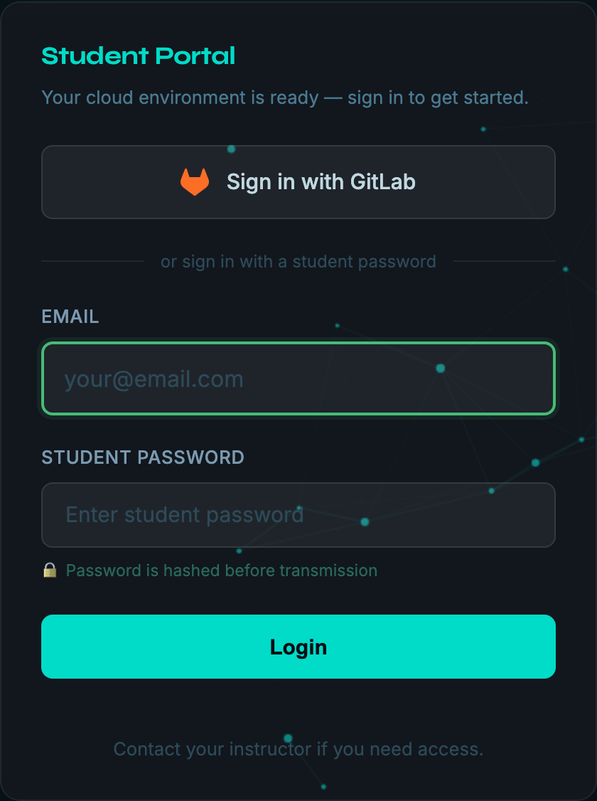
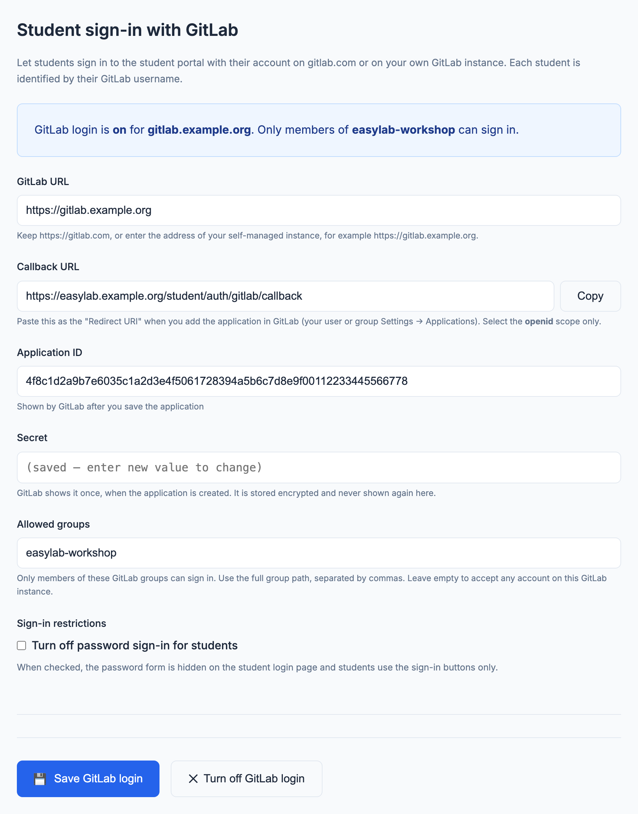

# GitLab login (optional)

EasyLab can let **students** sign in to the student portal with their GitLab account, on **gitlab.com** or on a **self-managed GitLab instance**, instead of (or in addition to) the shared student password. Admin login is not affected.

---

## How it works

When enabled, a **Sign in with GitLab** button appears on the student login page.

1. The student clicks **Sign in with GitLab** and is redirected to the configured GitLab instance to authorize the EasyLab application.
2. EasyLab reads the student's GitLab username and the groups they belong to. If you restricted sign-in to groups, the student must be a member of at least one of them.
3. EasyLab creates a local session. The student is identified as `<username>@users.noreply.<gitlab host>` (for example `tanuki@users.noreply.gitlab.com`), so their workspaces are owned by their GitLab username.

{ width=300 }

EasyLab requests the `openid` scope only. It cannot read the student's email address, projects or anything through the GitLab API. The GitLab token is used once during sign-in and is not stored.

!!! note "Labs with their own student portal"
    A lab's [in-lab student portal](student-portal.md) shows the same **Sign in with GitLab** button, on its own address. The sign-in still runs through this (central) instance, which then hands the student back to the lab's portal — so the redirect URI below is the only one to register, whatever the number of labs. It requires `EASYLAB_PUBLIC_URL` to be set.

---

## Setup — GitLab application

1. In EasyLab, open **GitLab** in the admin sidebar (`/admin/gitlab`) and copy the **Callback URL** shown in the form.
2. In GitLab, add an application. Any of these works:
    - **User-owned** — your avatar → **Preferences → Applications → Add new application**
    - **Group-owned** — the group's **Settings → Applications**
    - **Instance-wide** (self-managed, administrators only) — **Admin area → Applications**
3. Fill in:
    - **Name** — what students see on the authorization screen, e.g. `EasyLab workshop`
    - **Redirect URI** — the value copied in step 1 (`https://<your-easylab-host>/student/auth/gitlab/callback`)
    - **Confidential** — leave checked
    - **Scopes** — select **openid** only
4. Save the application and keep the **Application ID** and the **Secret**. GitLab shows the secret only once.

---

## Configuration — admin UI

1. Open **GitLab** in the admin sidebar.
2. Set the **GitLab URL**:
    - keep `https://gitlab.com` for gitlab.com
    - for a self-managed instance, enter its address, e.g. `https://gitlab.example.org` (an instance served under a path, such as `https://example.org/gitlab`, is supported)
3. Enter the **Application ID** and **Secret**.
4. Optionally enter **Allowed groups** (see below).
5. Click **Save GitLab login**.

The change takes effect immediately, without restarting the server. The box at the top of the page states whether GitLab login is on, for which instance, and who can sign in.

{width=700}

The secret is stored encrypted on the server and is never displayed again. Leave the field empty when saving to keep the stored secret; type a new value to replace it.

To turn GitLab login off, click **Turn off GitLab login**. This removes the stored application ID and secret.

!!! note

    The EasyLab server itself must be able to reach the GitLab instance over the network, not only the students' browsers: it calls GitLab directly to complete each sign-in. Use an `https://` URL; `http://` is accepted for test setups and the settings page shows a warning when it is used.

### Allowed groups

By default **any account on the GitLab instance** can sign in — on gitlab.com, that is anyone who has the URL of your student portal. The settings page shows a warning while this is the case.

To limit access, enter one or more GitLab groups by their **full path** (the path in the group's URL, e.g. `my-group` or `my-group/workshop-2026`), separated by commas. Only members of at least one listed group can sign in. A member of a parent group is also a member of its subgroups, as GitLab reports it. Listing a subgroup does not admit members of other subgroups of the same parent.

Students who signed in before a restriction was added keep their session until it expires (24 hours).

### Sign-in restrictions

Once GitLab login is on, **Turn off password sign-in for students** hides the password form on the student login page, so students can only use the sign-in buttons. The password form comes back automatically if GitLab login is turned off.

### Student identity and other sign-in methods

A workspace is owned by the part of the student's identity before the `@`. This has two consequences:

* A student signing in with GitLab as `tanuki` and a student typing `tanuki@example.com` in the password form share the same workspaces. The email typed in the password form is not verified, so turn off password sign-in for students when a workshop uses GitLab login.
* If [GitHub login](github.md) and GitLab login are both on, the GitHub user `tanuki` and the GitLab user `tanuki` also share the same workspaces, even when they are two different people. Offer one of the two per workshop, or restrict both to your own organization and group.

Characters that are not valid in a workspace name are replaced by `-` (a GitLab user `jane.doe` owns workspaces as `jane-doe`).

Changing the GitLab URL later changes how students are displayed (`users.noreply.<host>`), but not the username part, so they keep their workspaces.
