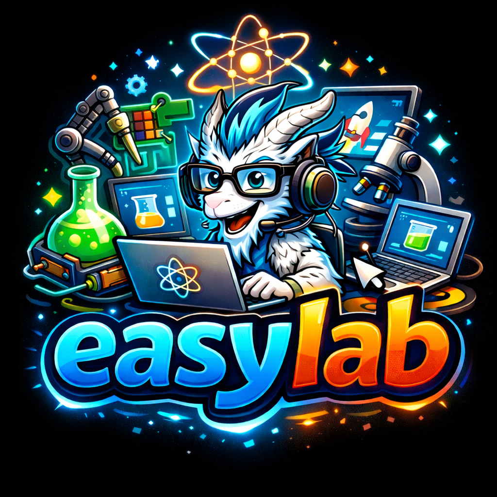
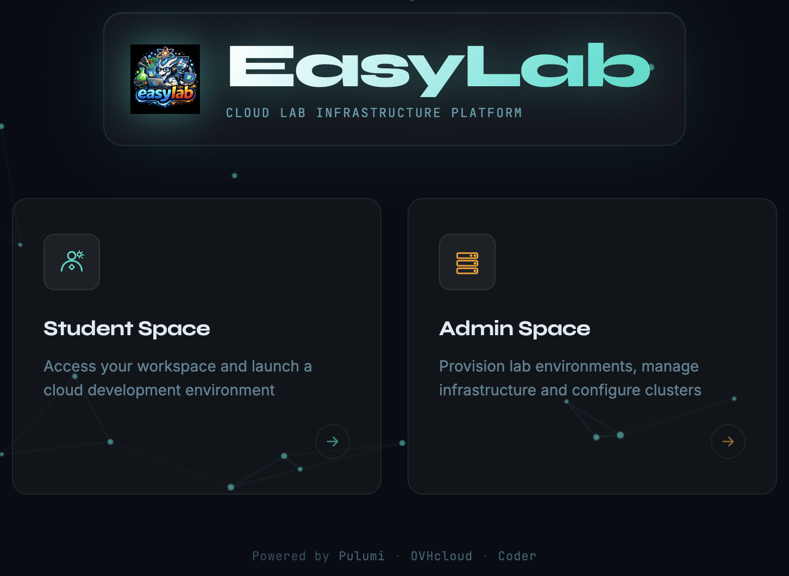

{width=200}

# EasyLab

EasyLab is a platform that helps you manage your lab environments. Provision labs on OVHcloud or use your own Kubernetes cluster; run a dry run to preview changes before creating a lab; manage workspaces and recreate destroyed labs from the same configuration.

> Go to [Admin documentation](admin.md)

For your students, they can access the student space to request a new development environment or to retrieve information about their environments.

> Sample Coder templates: [yodamad-workshops/coder-templates](https://gitlab.com/yodamad-workshops/coder-templates)

> Go to [Student documentation](student.md)

