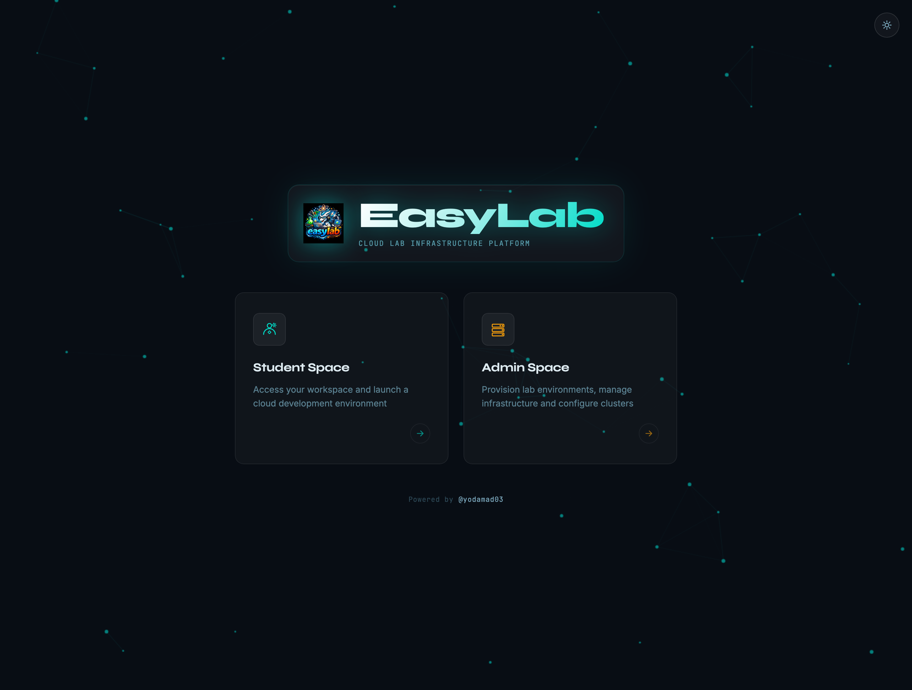
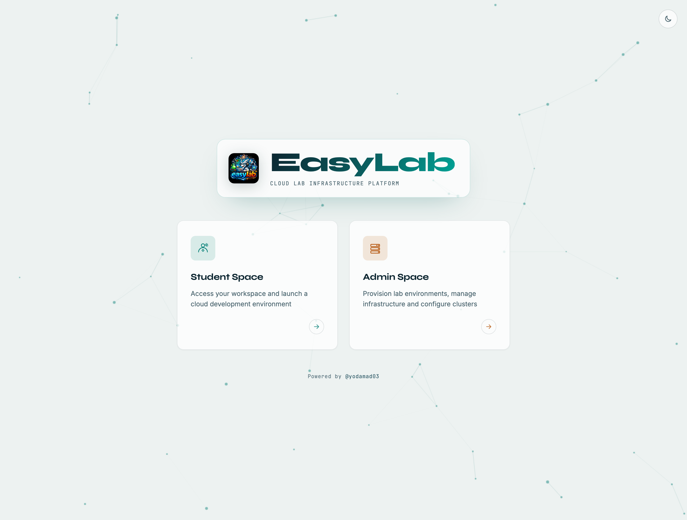

{width=200}

# EasyLab

EasyLab is a platform that helps you manage your lab environments. Provision labs on OVHcloud or use your own Kubernetes cluster; run a dry run to preview changes before creating a lab; manage workspaces and recreate destroyed labs from the same configuration.

> Go to [Admin documentation](admin.md)

For your students, they can access the student space to request a new development environment or to retrieve information about their environments.

> Go to [Student documentation](student.md)

## Light and dark theme

The homepage follows your system's light or dark preference. Use the sun/moon button in the top-right corner to switch theme; your choice is remembered in the browser.

