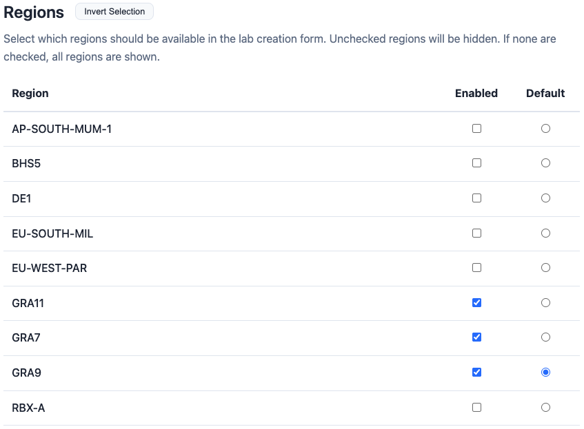
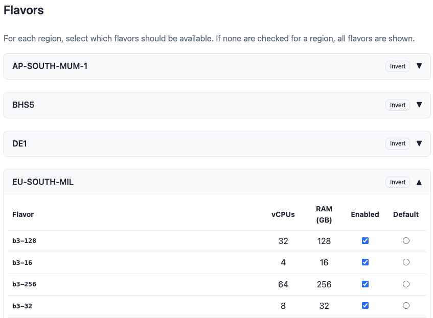
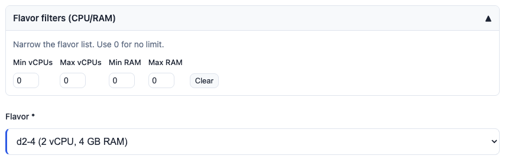

# OVHcloud configuration

This section is dedicated to the OVHcloud configuration. It applies only when you choose **Create New Infrastructure** in the lab wizard. When using **Use Existing Cluster**, OVHcloud credentials and configuration are not required.

## Setting credentials

OVHcloud API credentials can be set in either of these ways:

1. **Admin UI** — In the header, go to **OVH** → **Credentials** and enter your application key, secret, consumer key, service name, and endpoint. Credentials are stored in memory only and cleared on server restart.
2. **Environment variables** — Set the variables listed below before starting EasyLab (e.g. in Docker, Helm, or via an [environment file](docker.md#environment-file) when running the server). If all required OVH variables are set at startup, they are loaded automatically.

## Configuration keys reference

All configuration keys related to OVHcloud are listed below. These are set via the EasyLab UI; keys used only when running Pulumi CLI directly are not documented here.

### API credentials (environment variables)

| Key | Description | Default |
|-----|-------------|---------|
| `OVH_APPLICATION_KEY` | OVHcloud application key | - |
| `OVH_APPLICATION_SECRET` | OVHcloud application secret | - |
| `OVH_CONSUMER_KEY` | OVHcloud consumer key | - |
| `OVH_SERVICE_NAME` | OVHcloud project/service name | - |
| `OVH_ENDPOINT` | OVHcloud API endpoint | `ovh-eu` |

### Pulumi provider config

| Key | Description | Default |
|-----|-------------|---------|
| `ovh:endpoint` | OVHcloud API endpoint (set automatically from `OVH_ENDPOINT`) | `ovh-eu` |

### Network infrastructure (Pulumi config: `network:*`)

| Key | Description | Required |
|-----|-------------|----------|
| `network:region` | OVHcloud region (e.g. `GRA11`, `SBG5`) | Yes |
| `network:gatewayName` | Name of the gateway | Yes |
| `network:gatewayModel` | Gateway model | Yes |
| `network:privateNetworkName` | Name of the private network | Yes |
| `network:networkId` | Network ID | Yes |
| `network:networkMask` | Network mask (e.g. `255.255.255.0`) | Yes |
| `network:networkStartIp` | Start IP of the subnet range | Yes |
| `network:networkEndIp` | End IP of the subnet range | Yes |

### Node pool (Pulumi config: `nodepool:*`)

| Key | Description |
|-----|-------------|
| `nodepool:name` | Node pool name |
| `nodepool:flavor` | OVHcloud instance flavor |
| `nodepool:desiredNodeCount` | Desired number of nodes |
| `nodepool:minNodeCount` | Minimum number of nodes |
| `nodepool:maxNodeCount` | Maximum number of nodes |

### Kubernetes (Pulumi config: `k8s:*`)

| Key | Description |
|-----|-------------|
| `k8s:clusterName` | Managed Kubernetes cluster name |

## OVH Options

The **OVH Options** page lets you control which OVHcloud regions and flavors are available in the lab creation wizard. Access it from the **OVH** dropdown in the header, then click **Options**.

### Loading data from OVH

Before configuring options, you need to populate the local cache with regions and flavors from the OVH API:

1. Make sure your [OVH credentials](ovhcloud.md) are configured
2. Click **Refresh from OVH** to fetch the latest regions and flavors

If the cache is empty, the page displays a prompt with links to configure credentials and refresh.

### Configuring regions

Once data is loaded, a table lists all available OVH regions. For each region you can:

* **Enable/Disable** — Check or uncheck the region. Only enabled regions appear in the lab creation wizard (step 3 — network). If none are checked, all regions are shown.
* **Set as default** — Select one region as the default for new labs.
* **Invert Selection** — Quickly toggle all region checkboxes.

### Configuring flavors

Below the regions table, flavors are grouped by region in collapsible sections. For each flavor you can see its vCPUs and RAM, and:

* **Enable/Disable** — Only enabled flavors appear in the lab creation wizard (step 5 — node pool) when the corresponding region is selected. If none are checked for a region, all flavors are shown.
* **Set as default** — Select one flavor as the default for each region.
* **Invert** — Toggle all flavor checkboxes within a region.

### Flavor filters (vCPU and RAM)

You can restrict which flavors are shown by **vCPU and RAM** so that only instance types within a given size range appear. This applies both on the OVH Options page and in the lab creation wizard (step 5 — node pool), where a collapsible **Flavor filters** section is available.

* **Min vCPUs** / **Max vCPUs** — Only flavors with vCPU count inside this range are listed. Use **0** for no minimum or no maximum.
* **Min RAM (GB)** / **Max RAM (GB)** — Only flavors with RAM (in GB) inside this range are listed. Use **0** for no limit.

Filters are cumulative with region/flavor enablement: only flavors that are enabled *and* pass the vCPU/RAM bounds appear in the wizard. On the OVH Options page, set the values and click **Save Options** to persist them. In the wizard, you can adjust filters for that lab only; changing them there reloads the flavor dropdown. If no flavors match, the UI suggests adjusting filters or using 0 for no limit.

Click **Save Options** to persist your configuration (including flavor filters). The settings are stored on the server and apply to all future lab creation sessions.