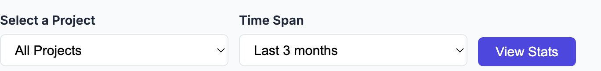

# Stats Dashboard

Navigate to **Stats** (accessible from the header or `/admin/stats`) to see aggregated deployment metrics.

Figures are cached for up to 30 seconds per project/time-span combination, so a just-completed change (a lab finishing, a workspace being created or cleaned) may take up to 30 seconds to appear here.

## Project selector

Use the **Select a Project** dropdown to scope the view to a single lab stack name, or choose **All Projects** for a combined view. The two views show different figures:

- **A single project** — a lab stack has exactly one outcome (it succeeded, failed, or was destroyed), so lab-level counts aren't useful there. The page shows **workspace-only** figures for that lab instead.
- **All Projects** — figures combine both lab-level and workspace-level counts across every tracked lab.

## Time span selector

Use the **Time Span** dropdown next to the project selector to limit the KPI cards and activity chart to a trailing window: **Last 7 days**, **Last month**, **Last 3 months**, **Last 6 months**, **Last year**, or **All time** (default). **Last 7 days** and **Last month** plot one point per day; longer windows (and **All time**) plot one point per month. Historical data from a deleted lab (see below) is only preserved at month granularity, so under a daily view it's attributed to the 1st of its month. The **Per-project breakdown** table always shows all-time totals regardless of the selected time span.

{width=700}

## KPI cards

Four summary cards are shown at the top of the page:

{width=700}

All four cards are scoped to the selected **Time Span** (see above) in addition to the selected project.

| Card | All Projects | Single project |
|------|--------------|----------------|
| **Workspaces Used** | Total workspaces created within the selected time span, across all tracked jobs, whether or not a lab has an auto-expiry lifetime configured | Same, scoped to this lab |
| **Currently Active** | Number of completed (live) labs created within the selected time span | Renamed **Active Workspaces**: workspaces created minus workspaces cleaned for this lab, within the selected time span |
| **Failed** | Number of labs that ended in a failed state within the selected time span | Hidden (not meaningful for a single lab) |
| **Workspaces Cleaned** | Count of workspaces deleted within the selected time span, whether automatically by the cleanup service or manually by an admin/student | Same, scoped to this lab |

Figures are preserved even after an old destroyed or failed lab is removed
from the admin list — deleting a lab drops it from the labs list, but its
historical contribution to these KPIs and to the activity chart below
remains.

## Activity chart

- **All Projects**: four lines — **Labs** (labs succeeded, failed, or destroyed in that data point's period, left axis) plus three workspace lines on the right axis: **Workspaces Total** (created in that period), **Workspaces Active** (a running total: workspaces created so far minus workspaces cleaned so far, i.e. how many were alive as of that point), and **Workspaces Cleaned** (cleaned in that period). A destroyed lab is counted against the period it was destroyed in, not the period it was created in. The period is a day or a month depending on the selected time span — see above.
- **Single project**: two lines, both on the same axis — **Workspaces created** and **Workspaces cleaned** for that lab.

## Per-project breakdown

When **All Projects** is selected, a summary table is shown below the chart listing each project with its total, active, and failed lab counts.

{width=700}