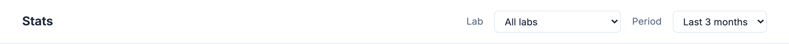
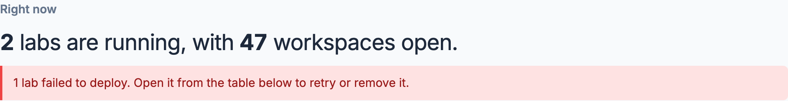
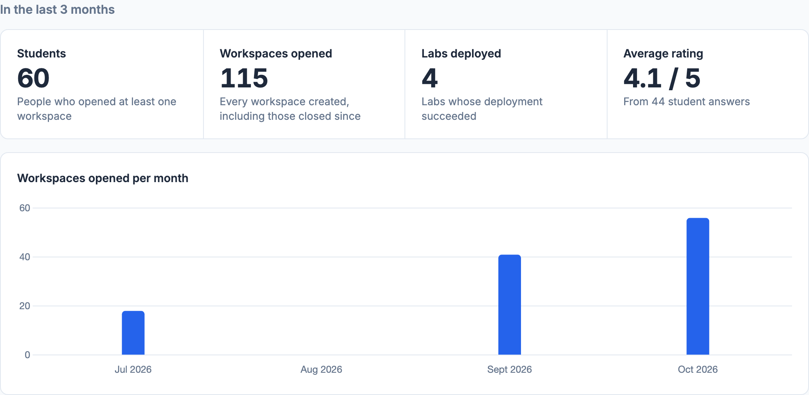
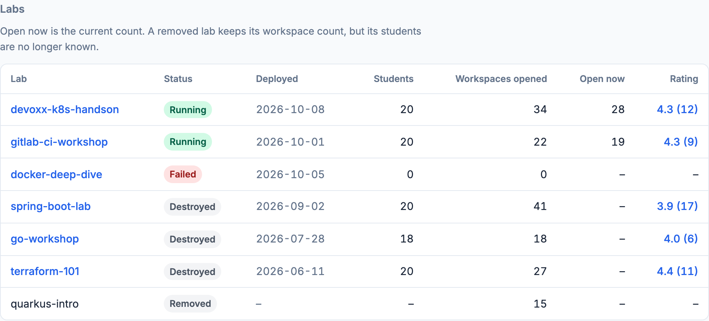

# Stats Dashboard

Navigate to **Stats** (in the sidebar, or `/admin/stats`) to see how your labs are used. The page answers three questions, top to bottom: what is running right now, what happened over a period, and how each lab did.

Figures are cached for up to 30 seconds per lab/period combination, so a just-completed change (a lab finishing, a workspace being created or closed) may take up to 30 seconds to appear here.

## Lab and period filters

Two dropdowns sit in the page header. The page reloads as soon as you change one.

{width=700}

- **Lab** — **All labs** (default), or a single lab stack name to scope every figure on the page to that lab.
- **Period** — **Last 7 days**, **Last month**, **Last 3 months**, **Last 6 months**, **Last year**, or **All time** (default). The period applies to the period figures, the chart and the labs table, but never to the **Right now** line.

The month-based periods start at the beginning of a calendar month: on 10 October, **Last 3 months** covers 1 July to today.

## Right now

One sentence says how many labs are running and how many workspaces are open in them. A running lab is a deployed lab whose cluster is still up — the thing that costs money. This line ignores the selected period.

{width=700}

- A workspace is **open** when it was created and has not been closed since, in a lab that is still running. Destroying a lab closes all its workspaces.
- If a lab failed to deploy, a red notice says how many did. Open the failed lab from the [labs table](#labs) to retry or remove it.

## Period figures

Four figures cover the selected period:

{width=700}

| Figure | What it counts |
|--------|----------------|
| **Students** | People who opened at least one workspace. Someone who attends two labs, or opens two workspaces, counts once. |
| **Workspaces opened** | Every workspace created, including those closed since — whether closed by the cleanup service, an admin or the student. |
| **Labs deployed** | Labs deployed during the period whose deployment succeeded, including labs destroyed since. Failed deployments are not counted. |
| **Average rating** | The mean of the 1–5 ratings students gave during the period, with the number of answers. See [Feedback](feedbacks.md). |

### Activity chart

Below the figures, a bar chart shows **workspaces opened** over the period: one bar per day for **Last 7 days** and **Last month**, one bar per month for longer periods. A day or month without activity is shown as an empty slot. Hover a bar for its exact count. The bars add up to the **Workspaces opened** figure.

## Labs

The table lists one row per lab:

{width=700}

| Column | Meaning |
|--------|---------|
| **Lab** | The lab's stack name. Click it to open the lab. |
| **Status** | **Running** (deployed and up), **Failed** (deployment failed), **Destroyed** (torn down), or **Removed** (deleted from the labs list). |
| **Deployed** | The date the lab was created. |
| **Students** | People who opened a workspace in this lab during the period. |
| **Workspaces opened** | Workspaces created in this lab during the period. |
| **Open now** | Workspaces currently open, for running labs only. Not affected by the period. |
| **Rating** | Average rating and number of answers during the period. Click it to read the lab's feedback. |

Running labs come first, then failed ones, then destroyed and removed labs, most recent first. Running and failed labs are always listed; a destroyed or removed lab is listed only if it was deployed or used during the selected period.

### Removed labs

Deleting an old destroyed or failed lab drops it from the labs list, but not from the stats: its workspaces still count in **Workspaces opened**, in the chart, and in **Labs deployed**. The lab keeps a **Removed** row here, grouped by stack name. Two things are lost on removal:

- **Students** — who opened the workspaces is no longer known, so removed labs show `–` and are left out of the **Students** figure.
- **Day-level detail** — history is kept per month, so under a daily chart a removed lab's workspaces are shown on the 1st of their month.
