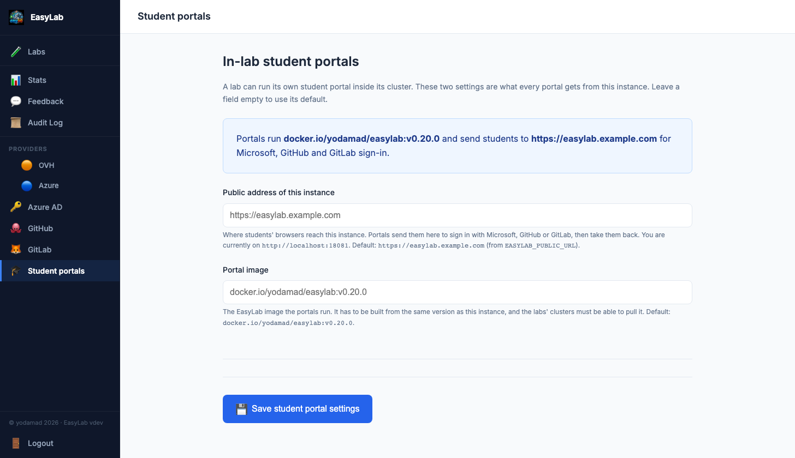

# In-lab student portal

By default one EasyLab instance serves both the **admin space** and the **student space**.
You can instead keep a single, central **admin** instance and deploy a **student portal
inside each lab's own cluster**, next to the workspaces it hands out.

What that changes:

* **Each lab has its own address** for students — `https://portal.<lab domain>` — instead
  of every lab sharing the central one.
* **A lab keeps working without the admin.** The portal serves students from a copy of
  the lab's configuration stored in its cluster, so they can sign in with the password,
  request and open workspaces while the central instance is down or unreachable.
* **The student-facing process holds no admin secrets.** It has no cluster-admin
  kubeconfig, no cloud or DNS credentials and no Pulumi — only a namespaced service
  account in the lab's cluster.

The two layouts can be mixed: the portal is a **per-lab option**, and labs without one keep
using the central student space.

## Run modes

The same image runs in three modes, set with `--mode` or the `EASYLAB_MODE` environment
variable:

| Mode | Serves | Use it for |
|------|--------|------------|
| `all` (default) | Admin space and student space | A single instance, as before. Labs may still get their own portal. |
| `admin` | Admin space only | A central admin whose labs all have their own portal. `/student/...` pages answer 404 and the homepage only offers the admin space. |
| `student` | The student space of one lab | The in-lab portal. **You never start this one yourself** — EasyLab deploys it. |

Nothing changes for an existing deployment: without the option, the mode is `all`.

## Give a lab its own portal

* **New labs get one by default.** On the wizard's **Workspace** step, **Deploy a
  dedicated student portal in this lab** is already checked; there is nothing else to do.
  The portal is deployed right after the lab's cluster is ready. Uncheck the box to keep
  a lab on the central student space.
* **Labs created before this feature** are left as they are. Open the lab's page; the
  **Overview** tab has a **Student portal** strip with a **Deploy student portal** button.
  See [Managing labs](admin-lab-management.md#student-portal).

The portal is served at `portal.<lab domain>`, with the same certificate as the lab's
workspaces (the wildcard certificate when the lab has a DNS provider, a certificate of
its own otherwise). A lab without a domain gets `http://portal.<ingress IP>.nip.io`, like
its workspaces.

!!! note "Two labs on one domain"
    Two labs sharing both a namespace and a domain on the same cluster cannot both be
    served at `portal.<domain>`. The second one is refused, and the lab's page says which
    lab already holds the address.

## Configuration

### The Student portals page

Two settings apply to every portal. Set them from **Student portals** in the admin
sidebar (`/admin/student-portals`):

{width=850}

* **Public address of this instance** — where students' browsers reach the central
  instance, e.g. `https://easylab.example.com`. Portals send students there for
  Microsoft / GitHub / GitLab sign-in. Enter the address alone, without a path. The page
  shows the address you are currently browsing it on, which is usually the right one.
  Without a public address, portals offer password sign-in only.
* **Portal image** — the EasyLab image the portals run. Normally left empty: a released
  version uses its own release image.

The box at the top of the page says what portals currently get, and what is missing.
Leave a field empty to use its default (shown under the field). Saving applies to the
labs that already have a portal too, in the background: a new address reaches them
within seconds; a new image restarts them, which signs their students out.

### Environment variables

The same two settings can be given as environment variables on the **central** instance.
They are the **defaults**: a value saved on the page wins over them.

| Variable | Purpose | Default |
|----------|---------|---------|
| `EASYLAB_MODE` | `all` or `admin` (see above). Not on the page: it takes a restart. | `all` |
| `EASYLAB_PUBLIC_URL` | Default for **Public address of this instance** | unset — portals offer password sign-in only |
| `EASYLAB_PORTAL_IMAGE` | Default for **Portal image** | `docker.io/yodamad/easylab:v<this version>` |

With the Helm chart these are `config.mode`, `config.publicUrl` (defaults to the ingress
host) and `config.portalImage` (defaults to the release's own image) — see
[Helm](helm.md#in-lab-student-portals). A Helm install therefore needs nothing set on
the page.

!!! warning "The lab's cluster must be able to pull the portal image"
    The portal runs the EasyLab image on the **lab's** nodes. If you use a private mirror,
    make sure those nodes can pull from it.

!!! note "Development builds"
    The portal is the same program as the admin, started in student mode, so it needs an
    image built from the same code. A released version uses its own release image
    automatically. A build without a version (`make dev`, `go run`) has no such image:
    the wizard option is then greyed out and labs use the central student space. To try
    a portal from a development build, build and push an image from your code and enter
    it as the **Portal image** on the Student portals page.

## How students sign in

* **Password** — checked by the portal itself, against the same student password as the
  central instance (`LAB_STUDENT_PASSWORD`). It keeps working when the admin is down.
* **Microsoft, GitHub, GitLab** — the portal shows the same buttons as the central login
  page, but the sign-in itself runs on the **central** instance:

    1. the portal sends the student to the central instance;
    2. the central instance runs the provider's sign-in as usual;
    3. it sends the student back to the lab's portal with a signed, 60-second proof of who
       they are;
    4. the portal checks it and opens the session.

    Nothing has to be registered per lab: the callback URLs you configured for
    [Azure AD](azure-ad.md), [GitHub](github.md) and [GitLab](gitlab.md) stay the central
    instance's. This needs the [public address](#the-student-portals-page) to be set, and
    the central instance to be reachable when a student signs in.

Changes to the sign-in settings on the central instance (a provider enabled, password
sign-in turned off, an allowed organization) reach every portal automatically.

!!! note
    Students stay signed in for 24 hours. Sessions live in the portal's memory, so
    restarting or upgrading a portal signs its students out — as restarting the central
    instance always did.

## What the admin still does

The central instance remains where everything is decided and recorded:

* **Every change you make to a lab** — templates added or removed, a lab or template
  closed, a pre-baked image, the lifecycle — is copied to the portal within seconds.
* **Workspaces created or deleted, feedback and student activity** on the portal are
  collected back into the lab's workspace history, the [feedback](feedbacks.md) page, the
  [audit log](audit-log.md) and the [stats](stats.md). Collection runs every few minutes
  (`CLEANUP_INTERVAL_MINUTES`) and whenever you open the lab's page or its feedback, so
  what you see there is current. If the admin is down, the portal keeps it until it is back.
* **Automatic cleanup** (workspace lifetime, lab deletion date) still runs from the
  central instance.
* **Upgrades** — after you upgrade the central instance, each portal is moved to the new
  image on the next cycle.
* **Opening a student's workspace** as a teacher works as before, and the student is told
  about it in their portal.

On a combined (`all`) instance, a lab with its own portal is still listed in the central
student space too, so a student in several labs keeps one place that shows all their
workspaces.

## What is deployed in the lab's cluster

All in the lab's workspace namespace, named `easylab-portal-<lab id>`:

| Resource | Purpose |
|----------|---------|
| Deployment, Service, Ingress | The portal itself (one replica) and its address |
| ServiceAccount, Role, RoleBinding | The portal's identity and permissions |
| Secret `…-config` | The lab's configuration as students see it, and the sign-in settings |
| ConfigMap `…-outbox` | What the portal has to report back until the admin collects it |

The portal's Role is limited to that namespace: it can manage the workspace resources
(Deployments, Services, Ingresses, PersistentVolumeClaims) and write its own outbox.
Secrets are **read-only and limited by name** to its own config, the
[lab credentials](admin-lab-management.md#lab-credentials-private-registries-and-repositories)
the lab's templates reference, and the in-cluster registry's credentials. It cannot
create, change or list Secrets, cannot read any other Secret (another lab's portal
config, TLS keys), and has no access outside the namespace — except, for a lab without
a domain, reading the ingress controller's address. The list of readable Secrets
follows the templates: it is updated whenever you add, change or remove one.

!!! warning "Shared namespaces"
    Kubernetes permissions cannot be narrowed to one lab's *workspaces*: they are
    ordinary Deployments. If several labs share a namespace on a bring-your-own cluster,
    each portal can create, change and delete the others' workspaces — and a workspace
    it creates can mount any Secret of that namespace. For labs that must be isolated
    from each other, give each its own **Workspace Namespace**.

Removing the portal (or destroying the lab) deletes all of it, after collecting anything
still waiting in the outbox.
