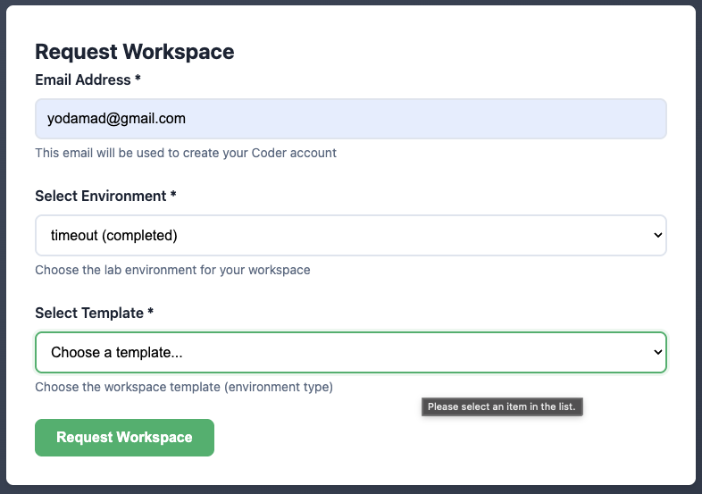
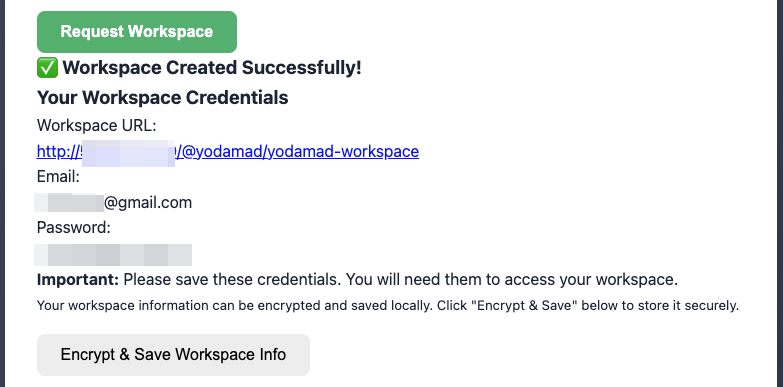
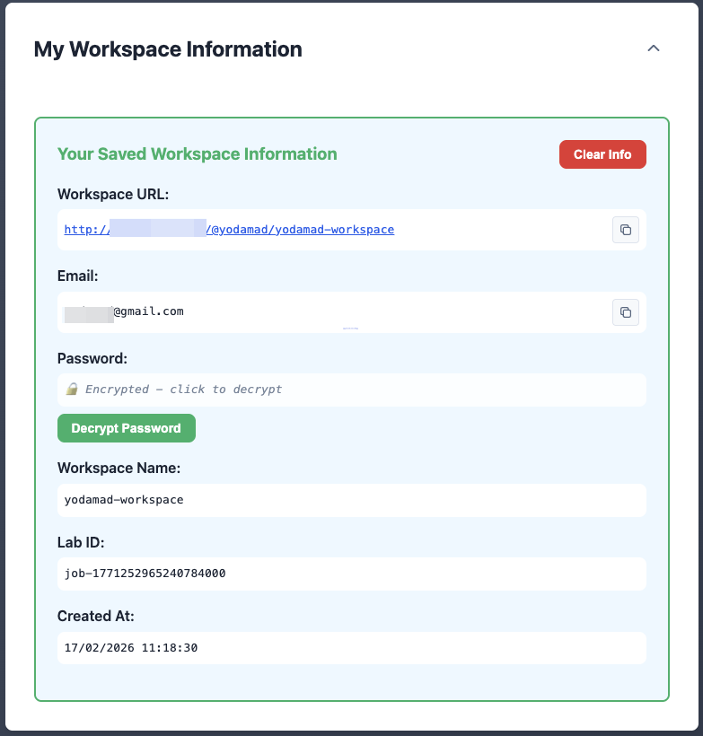

# Student Space

As a student, you have access to the student space to request a new development environment or to retrieve information about your environments.

## Request a new development environment

The request a new development environment page is the main page of the student space. It allows you to request a new development environment.

You just need to provide:

* [x] your email address
* [x] the lab you want to use

Then, you'll get all information needed to connect to your workspace!

Just use the provided link and credentials to connection to your workspace.

{width=85%}

### Save your workspace information

You can store the workspace information in a secured cookie in your browser to be able to retrieve information later if needed. You need to provide a password to encrypt and decrypt the workspace information.

{width=85%}

## Retrieve information about your environments

If you have already requested a workspace, you can retrieve information about your environments by clicking on the `My Workspace Information` panel.

You need to provide the same password you used to encrypt the workspace information to decrypt the workspace password.

{width=75%}