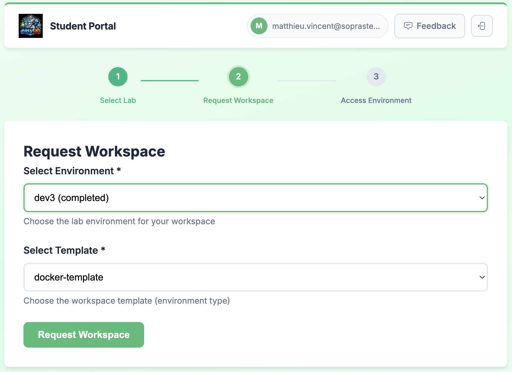
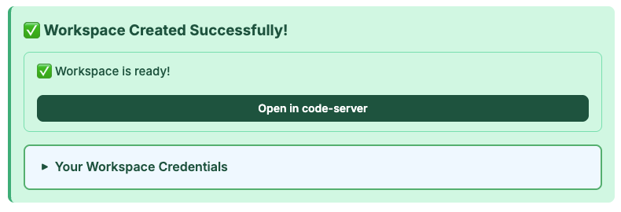
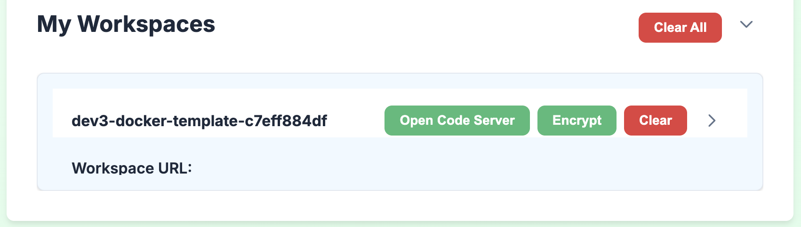

# Student Space

As a student, you have access to the student space to request new development environments or to retrieve information about your environments.

You can request **one workspace per template per lab**. If a lab has multiple templates (e.g. Docker, Go), you can request one workspace for each — so multiple workspaces in the same lab. Across different labs you can have even more workspaces running simultaneously.

## Request a new development environment

The request a new development environment page is the main page of the student space. It allows you to request a new development environment.

You need to provide:

* [x] your email address
* [x] the lab (environment) you want to use
* [x] the **template** (when the lab has multiple templates, a template dropdown appears — choose the workspace type you want)

Then, you'll get all information needed to connect to your workspace!

Just use the provided link and credentials to connect to your workspace.

{width=85%}

### Save your workspace information

You can store the workspace information in a secured cookie in your browser to be able to retrieve information later if needed. You need to provide a password to encrypt and decrypt the workspace information.

{width=85%}

## My Workspaces

When you have saved at least one workspace, the **My Workspaces** panel appears at the top of the student portal. It displays a card for each workspace you have requested — across different labs and different templates within the same lab.

### Workspace cards

Each card shows:

* **Workspace name** — the name assigned to your workspace
* **Workspace URL** — direct link to your Coder workspace (with a copy button)
* **Email** — the email used to create the workspace (with a copy button)
* **Password** — your workspace password, encrypted or in clear text (with a copy button)
* **Lab ID** — the lab this workspace belongs to
* **Created at** — when the workspace was created

### Encrypting and decrypting credentials

For each workspace card you can:

* **Encrypt** — Enter a password to encrypt your workspace credentials. The encrypted data is stored in a browser cookie. This protects your password if someone accesses your browser.
* **Decrypt** — Use the same password to reveal your workspace password later.

### Managing workspaces

* **Clear** — Remove a single workspace from your saved list
* **Clear All** — Remove all saved workspaces at once

The panel is collapsible — click the header to expand or collapse it.

## Retrieve information about your environments

If you have already saved a workspace, you can retrieve information about your environments from the **My Workspaces** panel described above.

You need to provide the same password you used to encrypt the workspace information to decrypt the workspace password.

{width=75%}