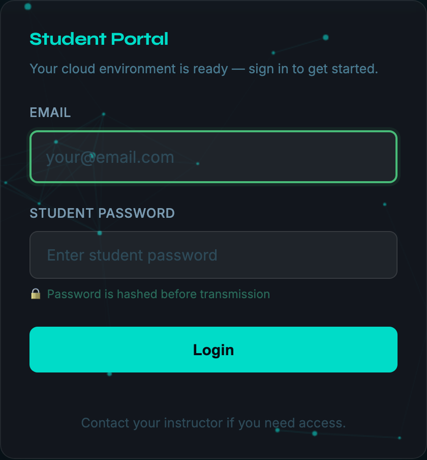
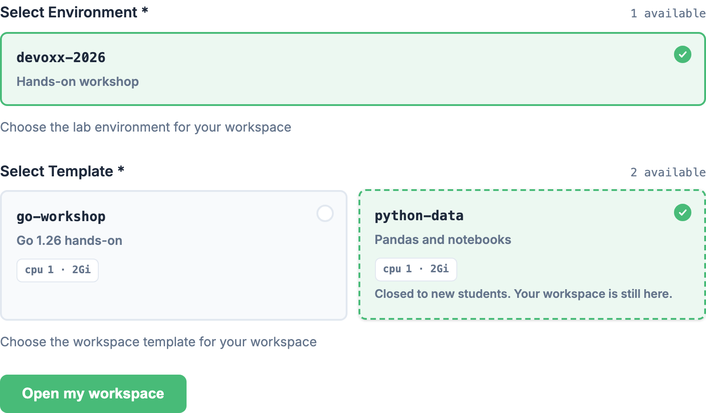
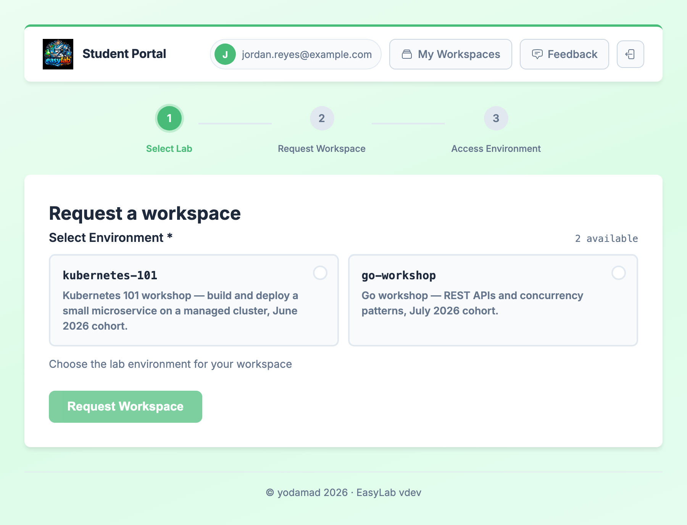
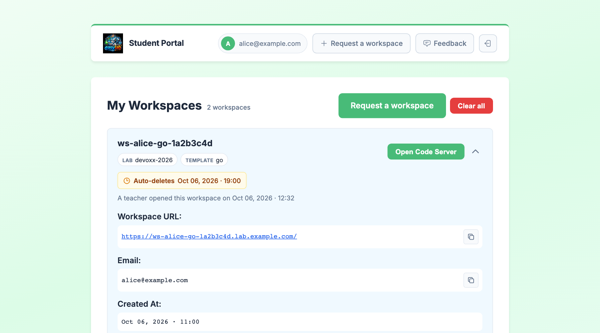
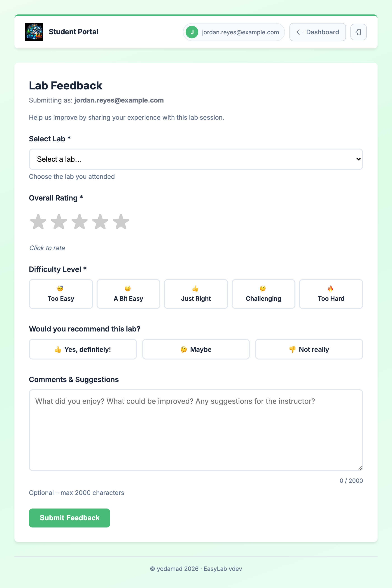

# Student Space

As a student, you have access to the student space to request new development environments or to retrieve information about your environments.

You can request **one workspace per template per lab**. If a lab has multiple templates (e.g. Docker, Go), you can request one workspace for each — so multiple workspaces in the same lab. Across different labs you can have even more workspaces running simultaneously.

Every student page shows the EasyLab copyright and version in a footer at the bottom of the page. The version reflects the latest Git tag the binary was built from (`dev` for local/untagged builds).

!!! note "Which address do I use?"
    Your workshop organiser gives you the address of the student space. It is either a
    shared one for every lab, or one dedicated to your lab (the lab's own domain). A
    dedicated one works exactly as described on this page, shows only that lab, and
    opens straight on the login page. Organisers: see
    [In-lab student portal](student-portal.md).

## Login

To access the student portal, you must log in with:

* **Email** — your email address (used to identify you and create your workspace)
* **Student Password** — provided by the workshop organiser

Your email is validated on submission and stored in your session. It will be pre-filled automatically on all subsequent pages so you don't need to enter it again.

After 5 failed password attempts, further attempts are locked out for 15 minutes as a brute-force protection. If you're locked out, wait 15 minutes and try again, or use Azure AD, GitHub or GitLab login if your workshop offers it.

{width=45%}

### Azure AD login (optional)

If the workshop organiser has configured Azure AD authentication, a **Sign in with Microsoft** button is displayed at the top of the login page, above the password form. Click it to authenticate with your Microsoft account — any valid account in the organisation's tenant is accepted. No separate student password is required via this method.

After a successful Azure AD login, your workspace account is created automatically using your Microsoft email address, exactly as with the password-based flow.

If the organiser has also enabled **Disable password login for students**, the password form is hidden entirely and only the Microsoft login button is shown.

### GitHub login (optional)

If the workshop organiser has configured [GitHub login](github.md), a **Sign in with GitHub** button is displayed at the top of the login page, above the password form. Click it and authorize EasyLab on GitHub — no student password is required. EasyLab only reads your GitHub username (and, if the organiser restricted access, whether you belong to the workshop's GitHub organization).

After a successful GitHub login you are identified by your GitHub username, shown in EasyLab as `<username>@users.noreply.github.com`, and your workspaces are created under that name.

If the organiser limited sign-in to a GitHub organization you are not a member of, you are sent back to the login page with a message — ask your instructor for access.

If the organiser has turned off password sign-in, the password form is hidden and only the sign-in buttons are shown.

{width=45%}

### GitLab login (optional)

If the workshop organiser has configured [GitLab login](gitlab.md), a **Sign in with GitLab** button is displayed at the top of the login page. It takes you to gitlab.com, or to the GitLab instance chosen by the organiser, where you authorize EasyLab — no student password is required. EasyLab only reads your GitLab username and the groups you belong to.

After a successful GitLab login you are identified by your GitLab username, shown in EasyLab as `<username>@users.noreply.<gitlab host>`, and your workspaces are created under that name.

If the organiser limited sign-in to a GitLab group you are not a member of, you are sent back to the login page with a message — ask your instructor for access.

{width=45%}

## Request a new development environment

The **Request a workspace** page is where you land after login. It allows you to request a new development environment. Your existing workspaces live on a separate **My Workspaces** page — reach it any time from the link in the header — so this page stays focused on the single task of requesting one.

You need to provide:

* [x] the **lab (environment)** you want to use — available labs appear as selectable cards, each showing the lab name and, when the organiser set one, a short description of what it's for. When only one lab is available it is selected for you.
* [x] the **template** — once you pick a lab, its templates appear as selectable cards. Each card shows the template name, a short description of what it provides, and its IDE, resources, and source repository, so you can tell them apart before choosing. When a lab has a single template it is selected for you.

Your email address is automatically filled in from your login session and is not editable on this form.

The organiser can close a lab or a template to new students. A closed one no longer appears here unless you already have a workspace on it. In that case its card has a dashed border and reads *"Closed to new students. Your workspace is still here."*, and the button becomes **Open my workspace**: it gives you back the link and connection token of your existing workspace instead of creating a new one. Your workspace also stays on the **My Workspaces** page.

{width=85%}

Then, you'll get all information needed to connect to your workspace!

Just use the provided link and credentials to connect to your workspace. A **View my workspaces →** link takes you to the My Workspaces page, where the new workspace is already listed.

The **connection token** is the password code-server asks for when you open the workspace URL directly. It is shown here, when you request the workspace; the My Workspaces page does not display it. You rarely need it: **Open Code Server** on the My Workspaces page signs you in for you.

!!! info "Waiting for DNS"
    Right after a workspace starts you may briefly see *"Workspace is up — waiting for DNS to propagate..."*. On a lab with a public domain, the workspace address is created in DNS when the environment is provisioned and can take up to a minute to become resolvable. EasyLab holds back the **Open** button until the address actually resolves, so you are not handed a link that fails with `DNS_PROBE_FINISHED_NXDOMAIN`. When the button turns green, the workspace is reachable.

{width=85%}

## My Workspaces

**My Workspaces** is its own page, reached from the link in the header (or the **View my workspaces →** link shown after you request one). It displays a card for each workspace you have requested — across different labs and different templates within the same lab. Only your own workspaces are shown. When you have none yet, the page invites you to request your first one.

{width=75%}

### Find your workspaces on another device

Your workspaces follow your login, not your browser. Nothing is stored on your laptop: sign in to the student portal from another computer with the **same email** (or the same Microsoft, GitHub or GitLab account) and **My Workspaces** lists the same workspaces, ready to open.

!!! info "Sign in the same way"
    A workspace belongs to the name before the `@` of the email you signed in with. Signing in with a different email, or with a different provider that gives you a different username, shows a different list.

If a lab cannot be reached when the page loads, a message says that some workspaces may be missing from the list. Reload the page a moment later.

### Workspace cards

Each card is collapsed by default and expands when you click its header (or the chevron), so a long list stays scannable. Even collapsed, a card always shows the essentials — its name, the **lab** and **template** it uses, and its auto-deletion badge — so you can tell workspaces apart without opening them.

Collapsed, each card shows:

* **Workspace name** — the name assigned to your workspace
* **Lab** and **Template** — the lab and workspace template this environment was created from, shown as small chips
* **Auto-deletion date** — when your workspace will be deleted automatically, shown as an amber *"⏳ Auto-deletes …"* badge with the date and hour. It only appears when the lab schedules a deletion (either a per-workspace lifetime or a lab-wide end date); if the lab sets no expiry, no badge is shown. Save anything you want to keep before this time.

* **Teacher access note** — if a teacher opened your workspace (to check your work or help you debug), the card says *"A teacher opened this workspace on …"* with the date and time of the latest time they did. Nothing is shown when no teacher has opened it.

Expand the card to reveal the rest:

* **Workspace URL** — direct link to your code-server workspace (with a copy button)
* **Email** — the email you are signed in with (with a copy button)
* **Created at** — when the workspace was created

An **Open Code Server** button is available on each card header — you don't need to expand the card to use it. Click it to open your code-server directly in a new tab — EasyLab resolves the workspace URL automatically so you don't need to copy it manually, and signs you in for you, so you land straight in the IDE without typing a password. The card does not show the workspace's connection token: if you open the workspace URL directly, code-server asks for the token you were given when you requested the workspace.

### Managing workspaces

* **Clear** — Delete a single workspace. It is removed from the lab (its environment is shut down and deleted) and from your list.
* **Clear All** — Delete all your workspaces at once, in the same way.

!!! warning "Clearing deletes the workspace"
    Clearing a workspace is not just a tidy-up of the list: the workspace itself is deleted from the lab, along with everything saved in it. Push or download anything you want to keep first. Once cleared, you can request a new workspace for that template from the **Request a workspace** page.

If a workspace cannot be deleted from the lab (for example the lab is temporarily unreachable), it stays in the list and a message asks you to try again. A workspace that is already gone — deleted by the organiser or by its auto-deletion date — no longer appears in the list.

## Submit feedback

After completing a lab session, you can share your experience via the **Feedback** page, accessible from the student portal header.

**Required fields:**

* **Lab** — Select the lab you attended from the dropdown.
* **Overall Rating** — Rate the session from 1 (Very Poor) to 5 (Excellent) using the star selector.
* **Difficulty Level** — Choose one: 😴 Too Easy / 🙂 A Bit Easy / 👍 Just Right / 🤔 Challenging / 🔥 Too Hard.

**Optional fields:**

* **Would you recommend this lab?** — Yes, definitely / Maybe / Not really.
* **Comments & Suggestions** — Free-text field (max 2000 characters) for any additional remarks.

Click **Submit Feedback** to send your response. A confirmation message appears on success. The form resets automatically so you can submit feedback for another lab if needed.

{width=45%}